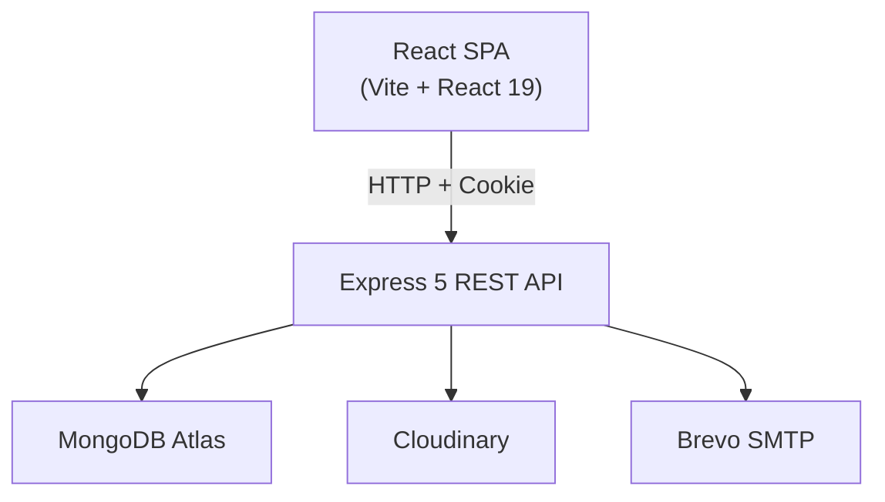

# NoteFlow — Full-Stack Note-Taking Application

> **Version:** 1.0.0 | **Stack:** React 19 + Express 5 + MongoDB Atlas

---

## 1. EXECUTIVE SUMMARY

| Attribute | Detail |
|---|---|
| **Project** | NoteFlow — A modern, fast, rich-text note-taking web app |
| **Target** | Knowledge workers, students, developers |
| **Core Features** | Rich-text editor (TipTap), notebooks/tags, pin/favorite/archive/trash, auto-save, ⌘K command palette, full-text search, dark/light theme, data export, avatar upload, password reset |
| **Architecture** | Two-tier: React SPA (Vite) + Express REST API (Mongoose → MongoDB Atlas) |



---

## 2. TECH STACK

**Frontend:** React 19, Vite 8, Tailwind CSS 3, Zustand 5, TanStack Query 5, React Router 7, TipTap 3, Radix UI, Lucide, cmdk, date-fns, DOMPurify, JSZip

**Backend:** Node.js, Express 5, Mongoose 9, jsonwebtoken, bcrypt, express-validator, helmet, cors, cookie-parser, express-rate-limit, multer, cloudinary, sanitize-html, nodemailer

**Database:** MongoDB Atlas  
**Infrastructure:** Cloudinary (images), Brevo (email)

---

## 3. FOLDER STRUCTURE

```
backend/
├── src/
│   ├── config/       # DB, Cloudinary, Mailer config
│   ├── models/       # User, Note, Notebook, Tag (Mongoose)
│   ├── routes/       # auth, me, notes, notebooks, tags
│   ├── controllers/  # Request/response handling
│   ├── services/     # Business logic
│   ├── middleware/    # auth, error, validate, upload, rateLimit
│   ├── validators/   # express-validator chains
│   └── utils/        # JWT tokens, response helpers, sanitize

frontend/
├── src/
│   ├── pages/            # Route-level components
│   ├── components/       # layout/, sidebars/, note/, search/, ui/
│   ├── editor/           # NoteEditor + EditorToolbar (TipTap)
│   ├── hooks/            # useNotes, useAuth, useAutosave, useTheme, etc.
│   ├── store/            # authStore, useUIStore (Zustand)
│   ├── lib/              # fetchWithAuth, utils (cn), sanitize
│   └── App.jsx           # Root: QueryClient + Router + Bootstrap
```

---

## 4. FRONTEND ARCHITECTURE

### Routing
```
/ -> redirect /notes
/login, /register, /forgot-password, /reset-password  (PublicRoute)
/notes, /favorites, /archive, /trash                    (PrivateRoute → AppLayout)
/notebooks/:notebookId, /tags/:tagId
/settings, /search
```

### State Management
- **Zustand:** `authStore` (user/session), `useUIStore` (theme/font/sidebar — persisted to localStorage)
- **TanStack Query:** All server state (notes, notebooks, tags, profile) — auto-caching, mutation invalidation
- All API calls via `fetchWithAuth` — uses `credentials: "include"` to send httpOnly JWT cookie

### Layout
```
AppLayout
├── Sidebar (collapsible, Sheet on mobile)
│   ├── ActionButtons (New note, Search)
│   ├── NavSections (All, Favorites, Archive, Trash)
│   ├── NotebooksSection → NotebookRow (×N)
│   ├── TagsSection → TagRow (×12 max)
│   └── UserSection
├── AppHeader (sidebar toggle, Logo, Search, New, Avatar)
├── <Outlet/> (page content)
└── CommandPalette (⌘K dialog overlay)
```

---

## 5. BACKEND ARCHITECTURE

### API Routes

| Prefix | Auth | Rate Limit | Purpose |
|---|---|---|---|
| `/api/v1/auth` | Mixed | 10/min | register, login, logout, forgot/reset password, verify |
| `/api/v1/me` | Required | — | profile, password, avatar, delete account |
| `/api/v1/notebooks` | Required | — | CRUD notebooks |
| `/api/v1/tags` | Required | — | CRUD tags |
| `/api/v1/notes` | Required | — | CRUD + pin/fav/archive/trash/purge/restore |

### Middleware Chain
```
Request → helmet → cors → cookieParser → express.json (2MB) → morgan (dev) → generalLimiter (100/min)
→ Route-specific: authRequired | authLimiter | validate → Controller → Service → DB → Response
→ notFoundHandler (404) / errorHandler (global)
```

### Auth Flow
- JWT in httpOnly cookie (`noteflow_token`, 7d expiry, sameSite: lax)
- Session restored on app boot via `GET /auth/verify`
- Password: bcrypt (cost 12)
- Reset token: 32-byte random → SHA-256 hash → 1-hour expiry

---

## 6. DATABASE MODELS

```mermaid
erDiagram
    User ||--o{ Note : creates
    User ||--o{ Notebook : creates
    User ||--o{ Tag : creates
    Note }o--|| Notebook : belongs_to
    Note }o--o{ Tag : tagged_with
    
    User { ObjectId id; string name; string email "unique"; string password "bcrypt"; string avatar; date deletedAt }
    Note { ObjectId id; string title; string content "HTML"; ObjectId userId FK; ObjectId notebookId FK; ObjectId[] tagIds FK; boolean isPinned; boolean isFavorite; boolean isArchived; object cover; number wordCount; date deletedAt }
    Notebook { ObjectId id; string name "unique per user"; string color; ObjectId userId FK; date deletedAt }
    Tag { ObjectId id; string name "unique per user"; string color; ObjectId userId FK; date deletedAt }
```

---

## 7. KEY API ENDPOINTS

| Method | Endpoint | Auth | Purpose |
|---|---|---|---|
| POST | `/auth/register` | No | Create account (sets cookie) |
| POST | `/auth/login` | No | Sign in (sets cookie) |
| POST | `/auth/logout` | No | Clear cookie |
| GET | `/auth/verify` | Yes | Restore session |
| POST | `/auth/forgot-password` | No | Send reset email |
| POST | `/auth/reset-password` | No | Consume token, set new password |
| GET | `/me` | Yes | Get profile |
| PATCH | `/me` | Yes | Update name |
| POST | `/me/password` | Yes | Change password |
| POST | `/me/avatar` | Yes | Upload avatar (multipart) |
| DELETE | `/me` | Yes | Soft-delete account |
| GET/POST | `/notes` | Yes | List/Create notes |
| GET/PATCH/DELETE | `/notes/:id` | Yes | Read/Update/Soft-delete note |
| POST | `/notes/:id/pin` | Yes | Toggle pin |
| POST | `/notes/:id/favorite` | Yes | Toggle favorite |
| POST | `/notes/:id/archive` | Yes | Toggle archive |
| POST | `/notes/:id/restore` | Yes | Restore from trash |
| POST | `/notes/:id/purge` | Yes | Permanent delete |
| GET | `/notes/trash` | Yes | List trashed notes |
| GET/POST | `/notebooks` | Yes | List/Create notebooks |
| PATCH/DELETE | `/notebooks/:id` | Yes | Update/Soft-delete notebook |
| GET/POST | `/tags` | Yes | List/Create tags |
| PATCH/DELETE | `/tags/:id` | Yes | Update/Soft-delete tag |

**Response Format:** `{ success: bool, data: any, code: string|null, message: string }`

---

## 8. KEY USER WORKFLOWS

### Auto-Save
```
User types → useAutosave hook detects change → 1s debounce → PATCH /notes/:id
→ Also saves on 10s interval + visibilitychange (tab blur) + unmount
→ Optimistic concurrency check (expectedUpdateAt vs server updatedAt)
→ Retries up to 3 times on failure
```

### Session Restore
```
App mounts → Bootstrap calls authStore.restoreSession()
→ GET /auth/verify (sends cookie)
→ 200: set user → PrivateRoute renders AppLayout
→ 401: set user=null → PublicRoute shows Login
```

### Search
```
User types query → SearchPage filters all notes client-side
→ Filters by: text, notebook, tag, date range, pinned status
→ Results shown inline + click navigates to /notes/:id
→ Query persisted in URL params (shareable)
```

---

## 9. CODE QUALITY & SECURITY

### Ratings

| Dimension | Score | Key Issues |
|---|---|---|
| Architecture | 7/10 | Clean layers, no pagination, no caching |
| Code Quality | 7/10 | Consistent patterns, filename typos (`arror.js`, `fecthWithAuth.js`) |
| Scalability | 6/10 | No pagination, all notes fetched at once |
| Security | 7/10 | helmet, validation, bcrypt; missing CSRF, refresh tokens, CSP |
| Maintainability | 8/10 | Well-organized, clear responsibilities |
| Performance | 5/10 | No lazy loading, no bundle analysis, no pagination |

### Key Security Measures
- httpOnly + secure + sameSite cookies for JWT
- bcrypt (cost 12) for passwords
- express-validator on all inputs
- sanitize-html (server) + DOMPurify (client) for XSS
- Rate limiting: auth (10/min), general (100/min)
- Helmet security headers
- CORS restricted to configured origins
- Password reset token hashed with SHA-256, 1-hour expiry

---

## 10. TOP IMPROVEMENTS

### Short-Term
1. Fix typos: `arror.js`→`error.js`, `fecthWithAuth.js`→`fetchWithAuth.js`
2. Add `staleTime` to TanStack queries (reduce refetches)
3. Route-level code splitting with `React.lazy()`
4. Add `React.memo` on `NoteCard`

### Medium-Term
5. Migrate to **TypeScript**
6. Add **tests** (Vitest/Jest)
7. Implement **pagination** for notes
8. **Refresh token rotation** (15min access + 7d refresh)
9. Switch to **Redis-backed rate limiting** (already installed)
10. Add **CSRF protection**

### Long-Term
11. Wire up **AI features** (Anthropic API installed but empty)
12. **Docker + CI/CD** pipeline
13. **Real-time collaboration** (WebSocket/Yjs)
14. **Offline support** (Service Worker + IndexedDB)

---

## 11. QUICK START

```bash
# Backend
cd backend
cp .env.example .env  # Fill in MONGO_URI, JWT secrets, Cloudinary, Brevo
npm install
npm run dev           # Port 5000

# Frontend
cd frontend
npm install
npm run dev           # Port 5173
```

**Frontend:** `http://localhost:5173`  
**Backend:** `http://localhost:5000`  
**API Base:** `http://localhost:5000/api/v1`

---

*Onboarding doc — generated from full source analysis. June 2026.*
