# NoteFlow — Full-Stack Note-Taking Application

> **Internal Brand:** Notiva (DB name) | **UI Brand:** NoteFlow  
> **Version:** 1.0.0 | **Status:** Pre-production

---

## 1. EXECUTIVE SUMMARY

| Attribute | Detail |
|---|---|
| **Project Name** | NoteFlow |
| **Purpose** | A modern, fast, rich-text note-taking web application inspired by Notion and Linear |
| **Business Goal** | Provide individuals and teams with a lightweight, beautiful, real-time note-taking platform with powerful organization features |
| **Target Users** | Knowledge workers, students, developers, and anyone who needs to capture and organize thoughts |
| **Main Features** | Rich-text editing (TipTap), notebooks/tags organization, pin/favorite/archive/trash, auto-save, command palette (⌘K), full-text search, data export, dark/light theme, avatar upload, password reset |
| **Core Functionality** | Create, edit, organize, search, and manage notes with a responsive, keyboard-friendly UI |
| **Architecture** | Two-tier monorepo: React SPA (Vite) + Express REST API (Mongoose ODM → MongoDB Atlas) |

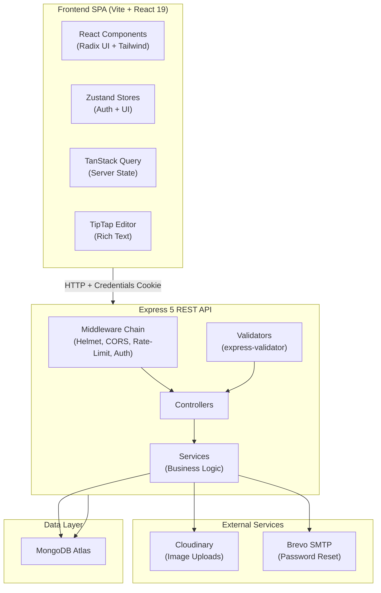
```mermaid
flowchart TB
    subgraph Client["Frontend SPA (Vite + React 19)"]
        UI["React Components<br/>(Radix UI + Tailwind)"]
        State["Zustand Stores<br/>(Auth + UI)"]
        Query["TanStack Query<br/>(Server State)"]
        Editor["TipTap Editor<br/>(Rich Text)"]
    end

    subgraph API["Express 5 REST API"]
        MW["Middleware Chain<br/>(Helmet, CORS, Rate-Limit, Auth)"]
        CTRL["Controllers"]
        SVC["Services<br/>(Business Logic)"]
        VAL["Validators<br/>(express-validator)"]
    end

    subgraph Ext["External Services"]
        CDN["Cloudinary<br/>(Image Uploads)"]
        MAIL["Brevo SMTP<br/>(Password Reset)"]
    end

    subgraph DB["Data Layer"]
        MONGO["MongoDB Atlas"]
    end

    Client -->|"HTTP + Credentials Cookie"| API
    API --> MONGO
    CTRL --> SVC
    SVC --> MONGO
    SVC --> CDN
    SVC --> MAIL
    MW --> CTRL
    VAL --> CTRL
```

---

## 2. PROJECT OVERVIEW

### What It Does
NoteFlow is a browser-based note-taking application. Users register, log in, and land on a dashboard with a sidebar (notebooks/tags), a note list, and a rich-text editor. Notes auto-save, support pinning, starring, archiving, and soft-delete with restore. Users can organize notes into **notebooks**, attach **tags**, add **cover colors/emojis**, and search everything via a global command palette.

### Problem It Solves
Existing note apps are either too complex (Notion), too simple (Apple Notes), or too slow. NoteFlow aims for the sweet spot: fast, keyboard-driven, beautiful UI, with just enough organizational power (notebooks + tags) without overwhelming the user.

### Main User Journeys
1. **First-time user:** Register → Create first note → Explore editor → Organize with notebooks/tags
2. **Daily user:** Log in → ⌘K to search → Open recent note → Edit (auto-save) → Close
3. **Power user:** Create notebooks → Tag notes → Use favorites → Archive old → Search with filters
4. **Account management:** Change password → Upload avatar → Export all notes → Delete account

### Application Lifecycle
```
Browser → Vite Dev Server (port 5173) → React App → Zustand/TanStack Query → fetchWithAuth
→ Express API (port 5000) → Middleware → Controller → Service → Mongoose → MongoDB Atlas
```

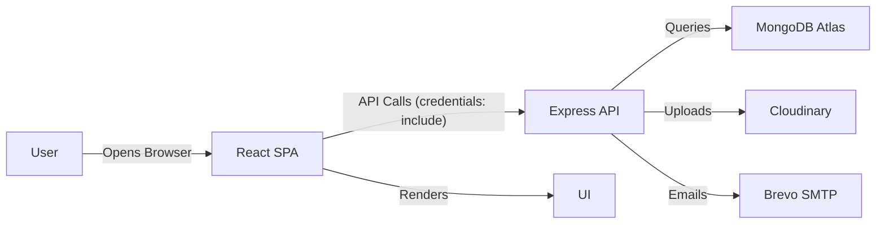
```mermaid
flowchart LR
    A[User] -->|"Opens Browser"| B[React SPA]
    B -->|"API Calls (credentials: include)"| C[Express API]
    C -->|"Queries"| D[MongoDB Atlas]
    C -->|"Uploads"| E[Cloudinary]
    C -->|"Emails"| F[Brevo SMTP]
    B -->|"Renders"| G[UI]
```

---

## 3. TECH STACK ANALYSIS

### Frontend

| Technology | Version | Purpose | Why Used | Alternatives |
|---|---|---|---|---|
| **React** | 19.2.x | UI framework | Industry standard, component model, ecosystem | Vue, Svelte, Solid |
| **Vite** | 8.x | Build tool & dev server | Fast HMR, native ESM, instant server start | Webpack, Turbopack |
| **Tailwind CSS** | 3.4.x | Utility-first CSS | Rapid UI development, consistent design system | CSS Modules, Styled Components |
| **Zustand** | 5.x | Client state management | Lightweight, no boilerplate, middleware (immer, persist, devtools) | Redux, Jotai, Context API |
| **TanStack Query** | 5.x | Server state & caching | Automatic caching, refetching, mutation invalidation | SWR, RTK Query |
| **React Router** | 7.x | Client-side routing | Nested routes, layout routes, SPA navigation | TanStack Router, Remix |
| **TipTap** | 3.x | Rich-text editor | ProseMirror-based, extensible, headless UI | Quill, Slate, Draft.js |
| **Radix UI** | 1.x | Accessible UI primitives | Unstyled, WAI-ARIA compliant, composable | Headless UI, Ariakit |
| **Lucide React** | 1.x | Icon library | Consistent SVG icons, tree-shakeable | Heroicons, Phosphor |
| **cmdk** | 1.x | Command palette (⌘K) | Accessible, searchable, keyboard-first | Custom implementation |
| **date-fns** | 4.x | Date formatting | Tree-shakeable, functional, no Moment.js bloat | dayjs, Luxon |
| **DOMPurify** | 3.x | XSS sanitization (client) | Client-side HTML sanitization before display | sanitize-html (server) |
| **JSZip** | 3.x | Client-side ZIP generation | Export notes as .zip archive | Server-side archiving |
| **file-saver** | 2.x | File download | Trigger file download from browser | Blob URL |
| **emoji-picker-react** | 4.x | Emoji picker | Lightweight emoji selection | Custom emoji picker |
| **immer** | 11.x | Immutable state updates | Used by Zustand for simpler state mutations | Manual spread |
| **class-variance-authority** | 0.7.x | Component variants | Tailwind-friendly component variants | Stitches, styled-components |
| **tailwind-merge** | 3.x | Class conflict resolution | Merge Tailwind classes without conflicts | clsx only |
| **tailwindcss-animate** | 1.x | Tailwind animations | CSS animation utilities | Custom keyframes |
| **lowlight** | 3.x | Syntax highlighting | Used by TipTap code blocks | Prism, highlight.js |

### Backend

| Technology | Version | Purpose | Why Used | Alternatives |
|---|---|---|---|---|
| **Node.js** | (runtime) | JavaScript runtime | Non-blocking I/O, npm ecosystem | Deno, Bun |
| **Express** | 5.x | HTTP framework | Mature, flexible, middleware-based | Fastify, Hono, Koa |
| **Mongoose** | 9.x | MongoDB ODM | Schema validation, middleware, query builder | Prisma, TypeORM, native driver |
| **jsonwebtoken** | 9.x | JWT signing/verification | Stateless auth token | jose, passport-jwt |
| **bcrypt** | 6.x | Password hashing | Industry-standard hashing (bcrypt rounds 12) | argon2, scrypt |
| **express-validator** | 7.x | Request validation | Declarative validation chains, sanitization | Joi, Zod, Yup |
| **helmet** | 8.x | HTTP security headers | Sets CSP, X-Frame-Options, etc. | Custom headers |
| **cors** | 2.x | Cross-Origin Resource Sharing | CORS configuration for frontend origin | Custom middleware |
| **cookie-parser** | 1.x | Cookie parsing | Parse httpOnly JWT cookies | Manual parsing |
| **express-rate-limit** | 8.x | Rate limiting | Rate-limit auth endpoints (10 req/min) | express-brute, rate-limiter-flexible |
| **multer** | 2.x | File upload middleware | Handle multipart/form-data for avatar uploads | formidable, busboy |
| **cloudinary** | 2.x | Image CDN | Upload and serve user avatars at scale | AWS S3, imgix |
| **nodemailer** | 8.x | Email sending | SMTP email transport | Brevo API (direct), SendGrid |
| **sanitize-html** | 2.x | HTML sanitization (server) | Strip XSS from rich-text note content | DOMPurify (server) |
| **archiver** | 7.x | Server-side ZIP | (Installed, not yet used — client-side JSZip used instead) | JSZip |
| **dotenv** | 17.x | Environment variables | Load `.env` in development | Built-in Node --env-file |
| **morgan** | 1.x | HTTP request logging | Dev-mode request logging | pino, winston |
| **ioredis** | 5.x | Redis client | (Installed, not yet used — for future rate-limit-redis) | node-redis |
| **rate-limit-redis** | 4.x | Redis-backed rate limiting | (Installed, not yet configured) | MemoryStore |

### Database

| Technology | Version | Purpose | Why Used |
|---|---|---|---|
| **MongoDB Atlas** | (cloud) | Primary database | Schema-less documents, easy scaling, free tier |
| **mongoose** | 9.x | ODM | Schema enforcement in JS, population, middleware |

### Infrastructure

| Service | Purpose |
|---|---|
| **Cloudinary** | Image hosting for user avatars |
| **Brevo (SendinBlue)** | Transactional email for password reset |
| **MongoDB Atlas** | Database-as-a-service |

---

## 4. FOLDER STRUCTURE ANALYSIS

```
note-taking-app-4/
├── backend/                          # Express 5 REST API
│   ├── .env                          # Environment variables (git-ignored)
│   ├── package.json                  # Backend dependencies
│   ├── jsconfig.json                 # JS language config (NodeNext)
│   ├── eslint.config.js              # ESLint flat config
│   └── src/
│       ├── server.js                 # Entry point: DB connect + listen
│       ├── app.js                    # Express app: middleware, routes, errors
│       ├── config/
│       │   ├── db.js                 # Mongoose connection
│       │   ├── cloudinary.js         # Cloudinary SDK config
│       │   └── mailer.js             # Brevo transactional email (raw fetch)
│       ├── models/
│       │   ├── User.js               # User model (name, email, password, avatar, resetToken)
│       │   ├── Note.js               # Note model (title, content, userId, notebookId, tagIds, flags)
│       │   ├── Notebook.js           # Notebook model (name, color, userId)
│       │   └── Tag.js                # Tag model (name, color, userId)
│       ├── routes/
│       │   ├── auth.routes.js        # /api/v1/auth (register, login, logout, forgot/reset, verify)
│       │   ├── me.routes.js          # /api/v1/me (profile, password, avatar, delete)
│       │   ├── notes.routes.js       # /api/v1/notes (CRUD + pin/fav/archive/trash/purge/restore)
│       │   ├── notebooks.routes.js   # /api/v1/notebooks (CRUD)
│       │   └── tags.routes.js        # /api/v1/tags (CRUD)
│       ├── controllers/
│       │   ├── auth.controller.js    # Auth request/response handling
│       │   ├── me.controller.js      # Profile request/response handling
│       │   ├── notes.controller.js   # Notes request/response handling
│       │   ├── notebooks.controller.js
│       │   └── tags.controller.js
│       ├── services/
│       │   ├── auth.service.js       # Auth business logic (register, login, tokens, reset)
│       │   ├── me.service.js         # Profile business logic (CRUD, password, avatar)
│       │   ├── notes.service.js      # Notes business logic (CRUD, toggle, soft-delete)
│       │   ├── notebook.service.js   # Notebooks business logic
│       │   ├── tags.service.js       # Tags business logic
│       │   ├── upload.service.js     # Cloudinary upload logic
│       │   └── email.service.js      # Password reset email template/sending
│       ├── middleware/
│       │   ├── auth.js               # JWT cookie verification → req.userId
│       │   ├── arror.js              # Error normalization + global error handler
│       │   ├── validate.js           # express-validator runner
│       │   ├── upload.js             # Multer memory storage (images only, 5MB)
│       │   └── rateLimit.js          # General (100/min) + Auth (10/min) rate limiters
│       ├── validators/
│       │   ├── auth.validators.js    # Register/login/forgot/reset validation chains
│       │   ├── me.validators.js      # Profile update/password validation chains
│       │   ├── notes.validators.js   # Note create/update validation chains
│       │   ├── notebooks.validators.js
│       │   └── tags.validators.js
│       └── utils/
│           ├── tokens.js             # JWT sign/verify + SHA-256 token hashing
│           ├── response.js           # ok() / fail() response helpers + asyncHandler
│           └── sanitize.js           # HTML sanitization + text extraction + word count
│
├── frontend/                         # React 19 SPA
│   ├── .env                          # VITE_BASE_API (git-ignored)
│   ├── index.html                    # HTML shell
│   ├── package.json                  # Frontend dependencies
│   ├── vite.config.js                # Vite config (React plugin)
│   ├── tailwind.config.js            # Tailwind design system (colors, fonts, animations)
│   ├── postcss.config.js             # PostCSS (Tailwind + Autoprefixer)
│   ├── eslint.config.js              # ESLint (React hooks + refresh)
│   ├── jsconfig.json                 # JS language config (JSX, ESNext)
│   ├── public/
│   │   └── icon.png                  # Favicon
│   ├── dist/                         # Production build output
│   └── src/
│       ├── main.jsx                  # React DOM entry point
│       ├── index.css                 # Global styles + design tokens + TipTap styles
│       ├── App.jsx                   # Root: QueryClientProvider + BrowserRouter + Routes
│       ├── lib/
│       │   ├── fetchWithAuth.js      # Authenticated fetch wrapper (credentials: include)
│       │   ├── utils.js              # cn() helper (clsx + tailwind-merge)
│       │   └── sanitize.js           # Client-side DOMPurify + word count + reading time
│       ├── store/
│       │   ├── authStore.js          # Zustand: user, register, login, logout, restoreSession, delete
│       │   └── useUIStore.js         # Zustand+immer+persist: theme, fontPref, sidebar, cmdk, noteList
│       ├── hooks/
│       │   ├── useAuth.js            # TanStack Query mutations: forgot/reset password
│       │   ├── useNotes.js           # TanStack Query: notes CRUD + toggle/pin/fav/archive/trash/purge
│       │   ├── useNotebooks.js       # TanStack Query: notebooks CRUD
│       │   ├── useTags.js            # TanStack Query: tags CRUD
│       │   ├── useMe.js              # TanStack Query: profile update, avatar, password change
│       │   ├── useAutosave.js        # Custom hook: debounce + interval + visibilitychange auto-save
│       │   ├── useCreateNoteContext.js # Derive defaults (notebookId, tagIds, etc.) from current route
│       │   ├── useTheme.js           # Apply theme + font preference to <html>
│       │   └── use-mobile.jsx        # Responsive hook: detect mobile breakpoint (768px)
│       ├── pages/
│       │   ├── Index.jsx             # Redirect / → /notes
│       │   ├── NotesPage.jsx         # Split-pane layout: note list + detail editor
│       │   ├── NoteDetailPage.jsx    # Full note editor with toolbar, cover, emoji, metadata
│       │   ├── SearchPage.jsx        # Advanced search with filters (notebook, tag, date, pinned)
│       │   ├── SettingsPage.jsx      # Profile, security, appearance, data export, account
│       │   └── auth/
│       │       ├── LoginPage.jsx     # Email + password login form
│       │       ├── RegisterPage.jsx  # Name + email + password registration
│       │       ├── ForgotPasswordPage.jsx # Email input for reset link
│       │       └── ResetPasswordPage.jsx # Token + new password form
│       ├── components/
│       │   ├── Logo.jsx              # App logo with gradient icon
│       │   ├── PrivateRoute.jsx      # Redirect to /login if unauthenticated
│       │   ├── PublicRoute.jsx       # Redirect to / if authenticated
│       │   ├── layout/
│       │   │   ├── AppLayout.jsx     # Main shell: Sidebar + AppHeader + Outlet + CommandPalette
│       │   │   ├── AppHeader.jsx     # Top bar: toggle sidebar, search, new note, avatar
│       │   │   └── Sidebar.jsx       # Responsive sidebar (Sheet on mobile, aside on desktop)
│       │   ├── sidebars/
│       │   │   ├── SidebarInner.jsx  # Logo, action buttons, nav, notebooks, tags, user section
│       │   │   ├── NavSections.jsx   # All notes, Favorites, Archive, Trash (with counts)
│       │   │   ├── NavItem.jsx       # Reusable sidebar nav link
│       │   │   ├── Section.jsx       # Sidebar section container + header
│       │   │   ├── ActionButtons.jsx # New note + Search (⌘K) buttons
│       │   │   ├── UserSection.jsx   # User avatar + name → settings link
│       │   │   ├── NotebooksSection.jsx # Notebook list with note counts
│       │   │   ├── NotebookRow.jsx   # Notebook nav item with context menu
│       │   │   ├── TagsSection.jsx   # Tag list with note counts (max 12)
│       │   │   ├── TagRow.jsx        # Tag nav item with context menu
│       │   │   ├── NameColorForm.jsx # Shared name + color picker form
│       │   │   ├── CreateNotebookDialog.jsx
│       │   │   ├── EditNotebookDialog.jsx
│       │   │   ├── EditNotebookForm.jsx
│       │   │   ├── DeleteNotebookDialog.jsx
│       │   │   ├── CreateTagDialog.jsx
│       │   │   ├── EditTagDialog.jsx
│       │   │   ├── EditTagForm.jsx
│       │   │   └── DeleteTagDialog.jsx
│       │   ├── note/
│       │   │   ├── NoteList.jsx      # Scrollable note list with loading/empty states
│       │   │   ├── NoteCard.jsx      # Note preview card (title, snippet, metadata)
│       │   │   └── EmptyEditor.jsx   # Empty state when no note is selected
│       │   ├── search/
│       │   │   └── CommandPalette.jsx # ⌘K dialog: search notes, actions, notebooks, tags
│       │   └── ui/                   # Radix UI primitives (shadcn-style)
│       │       ├── alert-dialog.jsx, avatar.jsx, badge.jsx, button.jsx, command.jsx
│       │       ├── context-menu.jsx, dialog.jsx, dropdown-menu.jsx, input.jsx
│       │       ├── label.jsx, popover.jsx, select.jsx, separator.jsx, sheet.jsx
│       │       ├── skeleton.jsx, sonner.jsx
│       ├── editor/
│       │   ├── NoteEditor.jsx        # TipTap editor setup + Cmd+S handler
│       │   └── EditorToolbar.jsx     # Formatting toolbar (headings, bold, lists, table, etc.)
│
├── .gitignore                        # Logs, node_modules, dist, .env
├── .qodo/                            # (Empty) Qodo agent config directory
└── README.md                         # This file
```

### Folder Responsibility Summary

| Folder | Responsibility |
|---|---|
| `backend/src/config/` | Third-party service configuration (DB, Cloudinary, Mailer) |
| `backend/src/models/` | Mongoose schemas with validation, indexes, toJSON transforms |
| `backend/src/routes/` | Express route definitions, middleware binding |
| `backend/src/controllers/` | Request/response handling, delegates to services |
| `backend/src/services/` | Business logic, database queries, external API calls |
| `backend/src/middleware/` | Auth, error handling, validation runner, upload, rate limiting |
| `backend/src/validators/` | express-validator chains for every route |
| `backend/src/utils/` | Shared utilities (JWT, response helpers, sanitization) |
| `frontend/src/store/` | Zustand stores for client state (auth, UI) |
| `frontend/src/hooks/` | Custom React hooks (TanStack Query wrappers, auto-save, theme) |
| `frontend/src/pages/` | Route-level page components |
| `frontend/src/components/layout/` | App shell (sidebar, header, layout) |
| `frontend/src/components/sidebars/` | All sidebar sub-components and dialogs |
| `frontend/src/components/note/` | Note list and card components |
| `frontend/src/components/search/` | Command palette |
| `frontend/src/components/ui/` | Reusable Radix UI primitives (shadcn-style) |
| `frontend/src/editor/` | TipTap editor and toolbar |
| `frontend/src/lib/` | Utility libraries (fetch, cn, sanitize) |

---

## 5. FRONTEND ARCHITECTURE

### Application Structure
The frontend follows a **feature-based** architecture within a single-page application pattern:

```
main.jsx → App.jsx → BrowserRouter → Bootstrap (session restore)
                     → PublicRoute (login, register, forgot, reset)
                     → PrivateRoute → AppLayout
                                       ├── Sidebar
                                       ├── AppHeader
                                       ├── <Outlet/> (pages)
                                       └── CommandPalette
```

### Routing Architecture
- **React Router v7** with nested layout routes
- `PublicRoute`: Redirects authenticated users to `/`
- `PrivateRoute`: Redirects unauthenticated users to `/login`
- Layout route `AppLayout` provides the persistent shell (sidebar + header)
- Child routes render via `<Outlet/>`
- Note detail is a **nested child route** of NotesPage, enabling split-pane layout

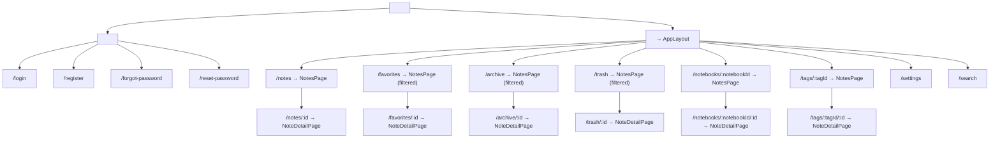
```mermaid
flowchart TD
    A["<Routes>"] --> B["<PublicRoute/>"]
    B --> C["/login"]
    B --> D["/register"]
    B --> E["/forgot-password"]
    B --> F["/reset-password"]
    A --> G["<PrivateRoute> → AppLayout"]
    G --> H["/notes → NotesPage"]
    H --> I["/notes/:id → NoteDetailPage"]
    G --> J["/favorites → NotesPage (filtered)"]
    J --> K["/favorites/:id → NoteDetailPage"]
    G --> L["/archive → NotesPage (filtered)"]
    L --> M["/archive/:id → NoteDetailPage"]
    G --> N["/trash → NotesPage (filtered)"]
    N --> O["/trash/:id → NoteDetailPage"]
    G --> P["/notebooks/:notebookId → NotesPage"]
    P --> Q["/notebooks/:notebookId/:id → NoteDetailPage"]
    G --> R["/tags/:tagId → NotesPage"]
    R --> S["/tags/:tagId/:id → NoteDetailPage"]
    G --> T["/settings"]
    G --> U["/search"]
```

### Layout Architecture
**AppLayout** provides a three-zone persistent shell:
1. **Sidebar** — Collapsible, responsive (Sheet on mobile, aside on desktop)
2. **AppHeader** — Top bar with branding, search, new note, user avatar
3. **Main Content** — `<Outlet/>` renders the current page

### Component Hierarchy
```
AppLayout
├── Sidebar
│   └── SidebarInner
│       ├── Logo
│       ├── ActionButtons (New note, Search)
│       ├── NavSections (All, Favorites, Archive, Trash)
│       ├── NotebooksSection → NotebookRow (×N)
│       ├── TagsSection → TagRow (×12 max)
│       └── UserSection
├── AppHeader
│   ├── PanelLeft (sidebar toggle)
│   ├── Logo (mobile)
│   ├── Search button
│   ├── New note button
│   └── Avatar → /settings
├── <Outlet/> (page content)
│   ├── NotesPage
│   │   ├── NoteList → NoteCard (×N)
│   │   └── NoteDetailPage or EmptyEditor or <Outlet/>
│   │       └── NoteDetailEditor
│   │           ├── SaveBadge
│   │           ├── EmojiPicker
│   │           ├── Cover picker
│   │           ├── Notebook Select
│   │           ├── Tags Popover
│   │           ├── Pin / Favorite / More buttons
│   │           ├── Title input
│   │           └── NoteEditor
│   │               └── EditorToolbar
│   ├── SearchPage
│   └── SettingsPage
└── CommandPalette (dialog overlay)
```

### Reusable Component Strategy
- **UI Primitives** (Radix-based): `button.jsx`, `dialog.jsx`, `input.jsx`, etc. — built with `cn()` utility for Tailwind class merging, `cva()` for variants
- **Sidebar Patterns**: `NavItem`, `Section`, `SectionHeader` — reused across nav sections, notebooks, and tags
- **Forms**: `NameColorForm` shared between notebook and tag creation/editing
- **Dialogs**: Consistent pattern using `DialogContent` + `DialogHeader` + `DialogFooter` from Radix

### State Management Architecture

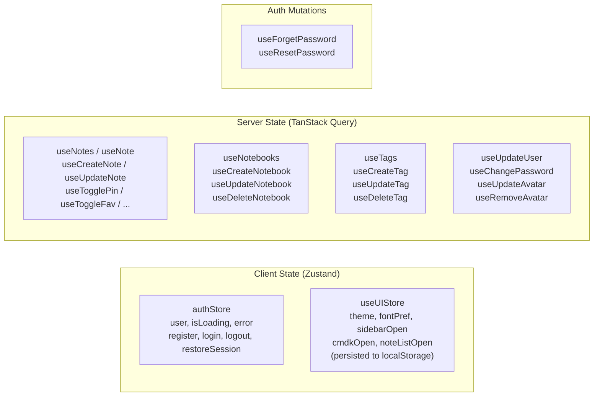
```mermaid
flowchart LR
    subgraph ClientState["Client State (Zustand)"]
        authStore["authStore<br/>user, isLoading, error<br/>register, login, logout, restoreSession"]
        uiStore["useUIStore<br/>theme, fontPref, sidebarOpen<br/>cmdkOpen, noteListOpen<br/>(persisted to localStorage)"]
    end
    subgraph ServerState["Server State (TanStack Query)"]
        notes["useNotes / useNote<br/>useCreateNote / useUpdateNote<br/>useTogglePin / useToggleFav / ..."]
        notebooks["useNotebooks<br/>useCreateNotebook<br/>useUpdateNotebook<br/>useDeleteNotebook"]
        tags["useTags<br/>useCreateTag<br/>useUpdateTag<br/>useDeleteTag"]
        me["useUpdateUser<br/>useChangePassword<br/>useUpdateAvatar<br/>useRemoveAvatar"]
    end
    subgraph AuthHooks["Auth Mutations"]
        auth["useForgetPassword<br/>useResetPassword"]
    end
```

**Data Lifecycle:**
1. **Zustand stores** hold client-only state (auth user, UI preferences, sidebar state)
2. **TanStack Query** manages all server state (notes, notebooks, tags, profile)
3. Mutations invalidate related queries on success (e.g., `useCreateNote` invalidates `["notes"]`)
4. UI store is **persisted** to `localStorage` via `zustand/middleware/persist` (theme, fontPref)
5. Auth store is **not** persisted — session is restored via `GET /auth/verify` on app boot

### API Communication Architecture
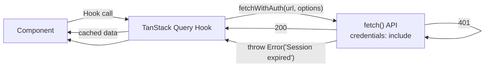
```mermaid
flowchart LR
    Component -->|"Hook call"| TanStackHook["TanStack Query Hook"]
    TanStackHook -->|"fetchWithAuth(url, options)"| Fetch["fetch() API<br/>credentials: include"]
    Fetch -->|"200"| TanStackHook -->|"cached data"| Component
    Fetch -->|"401"| Fetch -->|"throw Error('Session expired')"| TanStackHook --> Component
```

**Key details:**
- All API calls use `fetchWithAuth` which sets `credentials: "include"` to send the httpOnly JWT cookie
- No `Authorization` header — auth is cookie-based
- On 401, `fetchWithAuth` throws a descriptive error
- TanStack Query provides automatic retry, caching, and refetch on window focus

### Form Handling Architecture
- No form library — all forms use controlled `useState` + manual validation
- Login, register, forgot/reset password use inline validation
- Settings page uses mutations with TanStack Query
- Auto-save on NoteDetailPage uses `useAutoSave` custom hook (debounce + interval + visibility)

### Error Handling Architecture
- **Component-level:** try/catch in event handlers, errors displayed via `sonner` toast
- **API errors:** Caught by `fetchWithAuth`, propagated as `throw new Error(message)`
- **TanStack Query errors:** Caught in mutation `onError` or component-level try/catch

### Authentication Architecture
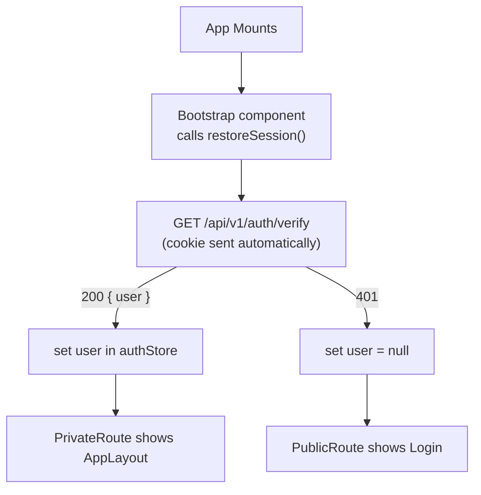
```mermaid
flowchart TD
    A[App Mounts] --> B["Bootstrap component<br/>calls restoreSession()"]
    B --> C["GET /api/v1/auth/verify<br/>(cookie sent automatically)"]
    C -->|"200 { user }"| D["set user in authStore"]
    C -->|"401"| E["set user = null"]
    D --> F["PrivateRoute shows AppLayout"]
    E --> G["PublicRoute shows Login"]
```

---

## 6. BACKEND ARCHITECTURE

### Route Architecture
All routes are versioned under `/api/v1/`:

| Prefix | Auth | Rate Limit | Purpose |
|---|---|---|---|
| `/api/v1/auth` | Mixed | 10/min | Register, login, logout, forgot, reset, verify |
| `/api/v1/me` | Required | — | Profile CRUD, password, avatar, delete account |
| `/api/v1/notebooks` | Required | — | Notebook CRUD |
| `/api/v1/tags` | Required | — | Tag CRUD |
| `/api/v1/notes` | Required | — | Note CRUD + toggle + trash + purge + restore |

### Controller Architecture
Controllers are thin — they parse the request, call a service, and format the response using `ok()` or `fail()` helpers:

```javascript
// Pattern:
export const list = async (req, res) => {
  const notes = await svc.listNotes(req.userId, req.query);
  return ok(res, notes, "List notes");
};
```

### Service Layer Architecture
Services contain all business logic and database operations. Each service file is a module of exported async functions.

**Service Responsibilities:**
| Service | Domain | Key Functions |
|---|---|---|
| `auth.service.js` | Authentication | `register()`, `login()`, `issueToken()`, `createResetToken()`, `consumeResetToken()` |
| `me.service.js` | User profile | `me()`, `update()`, `changePassword()`, `deleteAccount()`, `updateAvatar()` |
| `notes.service.js` | Notes | `listNotes()`, `getNote()`, `createNote()`, `updateNote()`, `softDelete()`, `restore()`, `permanentDelete()`, `toggleField()`, `trashNotes()` |
| `notebook.service.js` | Notebooks | `list()`, `create()`, `update()`, `remove()` |
| `tags.service.js` | Tags | `list()`, `create()`, `update()`, `remove()` |
| `upload.service.js` | File upload | `uploadImage()` → Cloudinary |
| `email.service.js` | Notifications | `sendResetEmail()` → Brevo SMTP |

### Middleware Chain
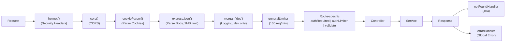
```mermaid
flowchart LR
    A["Request"] --> B["helmet()<br/>(Security Headers)"]
    B --> C["cors()<br/>(CORS)"]
    C --> D["cookieParser()<br/>(Parse Cookies)"]
    D --> E["express.json()<br/>(Parse Body, 2MB limit)"]
    E --> F["morgan('dev')<br/>(Logging, dev only)"]
    F --> G["generalLimiter<br/>(100 req/min)"]
    G --> H["Route-specific<br/>authRequired | authLimiter | validate"]
    H --> I["Controller"]
    I --> J["Service"]
    J --> K["Response"]
    K --> L["notFoundHandler<br/>(404)"]
    K --> M["errorHandler<br/>(Global Error)"]
```

### Authentication Flow
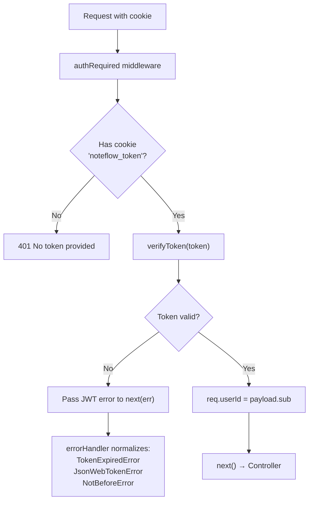
```mermaid
flowchart TD
    A["Request with cookie"] --> B["authRequired middleware"]
    B --> C{"Has cookie<br/>'noteflow_token'?"}
    C -->|"No"| D["401 No token provided"]
    C -->|"Yes"| E["verifyToken(token)"]
    E --> F{"Token valid?"}
    F -->|"No"| G["Pass JWT error to next(err)"]
    F -->|"Yes"| H["req.userId = payload.sub"]
    H --> I["next() → Controller"]
    G --> J["errorHandler normalizes:<br/>TokenExpiredError<br/>JsonWebTokenError<br/>NotBeforeError"]
```

### Validation Flow
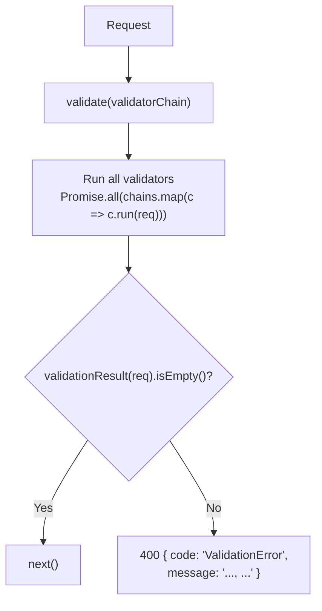
```mermaid
flowchart TD
    A["Request"] --> B["validate(validatorChain)"]
    B --> C["Run all validators<br/>Promise.all(chains.map(c => c.run(req)))"]
    C --> D{"validationResult(req).isEmpty()?"}
    D -->|"Yes"| E["next()"]
    D -->|"No"| F["400 { code: 'ValidationError',<br/>message: '..., ...' }"]
```

### Error Handling Strategy
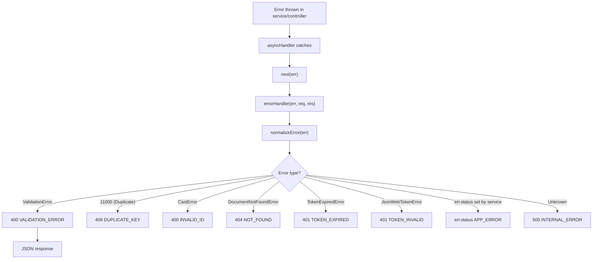
```mermaid
flowchart TD
    A["Error thrown in service/controller"] --> B["asyncHandler catches"]
    B --> C["next(err)"]
    C --> D["errorHandler(err, req, res)"]
    D --> E["normalizeError(err)"]
    E --> F{"Error type?"}
    F -->|"ValidationError"| G["400 VALIDATION_ERROR"]
    F -->|"11000 (Duplicate)"| H["409 DUPLICATE_KEY"]
    F -->|"CastError"| I["400 INVALID_ID"]
    F -->|"DocumentNotFoundError"| J["404 NOT_FOUND"]
    F -->|"TokenExpiredError"| K["401 TOKEN_EXPIRED"]
    F -->|"JsonWebTokenError"| L["401 TOKEN_INVALID"]
    F -->|"err.status set by service"| M["err.status APP_ERROR"]
    F -->|"Unknown"| N["500 INTERNAL_ERROR"]
    G --> O["JSON response"]
```

---

## 7. DATABASE ANALYSIS

### Entity Relationship Diagram

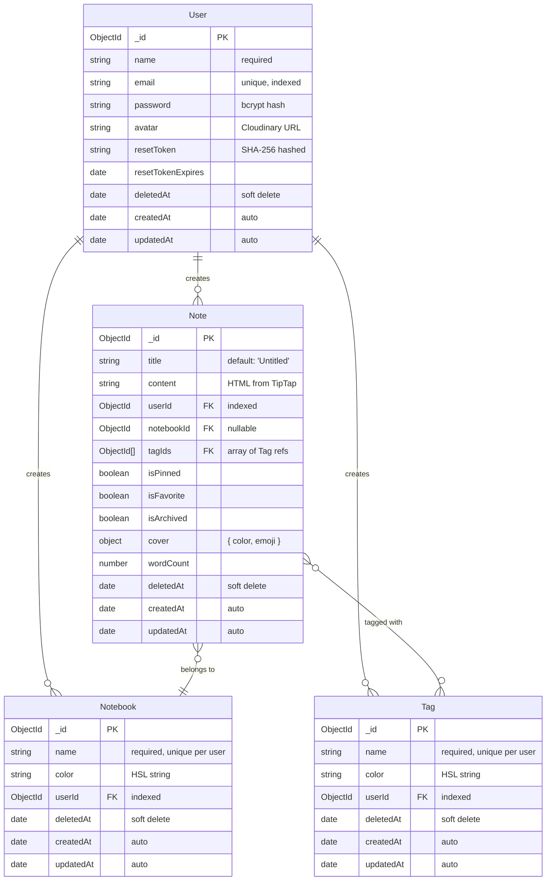
```mermaid
erDiagram
    User ||--o{ Note : "creates"
    User ||--o{ Notebook : "creates"
    User ||--o{ Tag : "creates"
    Note }o--|| Notebook : "belongs to"
    Note }o--o{ Tag : "tagged with"

    User {
        ObjectId _id PK
        string name "required"
        string email "unique, indexed"
        string password "bcrypt hash"
        string avatar "Cloudinary URL"
        string resetToken "SHA-256 hashed"
        date resetTokenExpires
        date deletedAt "soft delete"
        date createdAt "auto"
        date updatedAt "auto"
    }

    Note {
        ObjectId _id PK
        string title "default: 'Untitled'"
        string content "HTML from TipTap"
        ObjectId userId FK "indexed"
        ObjectId notebookId FK "nullable"
        ObjectId[] tagIds FK "array of Tag refs"
        boolean isPinned
        boolean isFavorite
        boolean isArchived
        object cover "{ color, emoji }"
        number wordCount
        date deletedAt "soft delete"
        date createdAt "auto"
        date updatedAt "auto"
    }

    Notebook {
        ObjectId _id PK
        string name "required, unique per user"
        string color "HSL string"
        ObjectId userId FK "indexed"
        date deletedAt "soft delete"
        date createdAt "auto"
        date updatedAt "auto"
    }

    Tag {
        ObjectId _id PK
        string name "required, unique per user"
        string color "HSL string"
        ObjectId userId FK "indexed"
        date deletedAt "soft delete"
        date createdAt "auto"
        date updatedAt "auto"
    }
```

### Model Details

#### User
| Field | Type | Required | Unique | Indexed | Notes |
|---|---|---|---|---|---|
| `name` | String | ✓ | — | — | 2-50 chars, letters/spaces only |
| `email` | String | ✓ | ✓ | ✓ | Lowercased, normalized |
| `password` | String | ✓ | — | — | bcrypt hash, cost 12 |
| `avatar` | String | — | — | — | Cloudinary secure_url |
| `resetToken` | String | — | — | — | SHA-256 hash of random token |
| `resetTokenExpires` | Date | — | — | — | 1-hour TTL |
| `deletedAt` | Date | — | — | — | Null = active |

**toJSON transform:** Strips `password`, `resetToken`, `resetTokenExpires`, `_id`, `__v`. Adds `id`.

#### Note
| Field | Type | Required | Default | Notes |
|---|---|---|---|---|
| `title` | String | — | "Untitled" | Max 50 chars |
| `content` | String | — | "" | HTML from TipTap, sanitized server-side |
| `userId` | ObjectId (User) | ✓ | — | Indexed |
| `notebookId` | ObjectId (Notebook) | — | null | Indexed, nullable |
| `tagIds` | [ObjectId (Tag)] | — | [] | Array of indexes |
| `isPinned` | Boolean | — | false | Pinned notes sort first |
| `isFavorite` | Boolean | — | false | Starred notes |
| `isArchived` | Boolean | — | false | Archived state |
| `cover` | `{ color, emoji }` | — | `{}` | Cover customization |
| `wordCount` | Number | — | 0 | Computed from content |
| `deletedAt` | Date | — | null | Null = active |

**Indexes:**
- `{ title: "text", content: "text" }` — Text search index for future use
- `{ userId: 1 }` — Primary lookup index

#### Notebook
| Field | Type | Required | Unique | Notes |
|---|---|---|---|---|
| `name` | String | ✓ | Compound (userId, name) | Trimmed |
| `color` | String | — | — | HSL format, default "245 80% 66%" |
| `userId` | ObjectId (User) | ✓ | — | Indexed |
| `deletedAt` | Date | — | — | Soft delete |

**Indexes:**
- `{ userId: 1, name: 1 }` — Unique compound index (no duplicate names per user)

#### Tag
| Field | Type | Required | Unique | Notes |
|---|---|---|---|---|
| `name` | String | ✓ | Compound (userId, name) | Trimmed |
| `color` | String | — | — | HSL format, default "200 80% 60%" |
| `userId` | ObjectId (User) | ✓ | — | Indexed |
| `deletedAt` | Date | — | — | Soft delete |

**Indexes:**
- `{ userId: 1, name: 1 }` — Unique compound index

---

## 8. API DOCUMENTATION

### Health Check

**Method:** `GET`  
**Route:** `/`  
**Purpose:** Health check  
**Auth:** None  
**Response:** `<h1>API is healthy</h1>`

---

### Authentication

#### `POST /api/v1/auth/register`

**Purpose:** Create a new user account  
**Auth:** None  
**Rate Limited:** Yes (10 req/min)

**Request:**
```json
{
  "name": "John Doe",
  "email": "john@example.com",
  "password": "SecureP@ss1"
}
```

**Response (201):**
```json
{
  "success": true,
  "data": {
    "user": {
      "id": "664f...",
      "name": "John Doe",
      "email": "john@example.com",
      "avatar": null,
      "deletedAt": null,
      "createdAt": "2025-01-01T00:00:00.000Z",
      "updatedAt": "2025-01-01T00:00:00.000Z"
    }
  },
  "code": null,
  "message": "registered"
}
```

**Sets Cookie:** `noteflow_token` (httpOnly, secure in prod, sameSite lax, 7d)

**Validation Rules:**
- `name`: Required, letters/spaces only, 2-50 chars
- `email`: Required, valid email format, normalized
- `password`: Required, min 8 chars, must contain uppercase, lowercase, number, special char

**Business Logic:**
1. Check if user exists → 409 if duplicate
2. Hash password with bcrypt (cost 12)
3. Create User document
4. Issue JWT `{ sub: userId }` with 7d TTL
5. Set cookie and return user (without password)

**Errors:** `409 User already exists`, `400 ValidationError`

---

#### `POST /api/v1/auth/login`

**Purpose:** Authenticate existing user  
**Auth:** None  
**Rate Limited:** Yes (10 req/min)

**Request:**
```json
{
  "email": "john@example.com",
  "password": "SecureP@ss1"
}
```

**Response (200):** Same as register

**Validation Rules:** Same as register password rules + email

**Business Logic:**
1. Find user by email → 401 if not found
2. Compare password with bcrypt → 401 if mismatch
3. Issue JWT, set cookie

**Errors:** `401 Invalid credentials`

---

#### `POST /api/v1/auth/logout`

**Purpose:** Clear authentication cookie  
**Auth:** None

**Response (200):** `{ "message": "logged out" }`

**Business Logic:** Clears `noteflow_token` cookie by overwriting with empty value and immediate expiry.

---

#### `GET /api/v1/auth/verify`

**Purpose:** Verify JWT and return current user  
**Auth:** Required (cookie)

**Response (200):**
```json
{ "data": { "user": { ... } }, "message": "verified" }
```

**Business Logic:**
1. `authRequired` middleware verifies JWT from cookie
2. Fetches user from DB via `me.service.js`
3. Returns user object

**Errors:** `401 NO_TOKEN`, `401 TOKEN_EXPIRED`, `401 TOKEN_INVALID`

---

#### `POST /api/v1/auth/forgot-password`

**Purpose:** Generate password reset token and send email  
**Auth:** None

**Request:**
```json
{ "email": "john@example.com" }
```

**Response (200):**
```json
{ "message": "If that email exists, a reset link has been sent" }
```

**Business Logic:**
1. Find user by email — silently return ok if not found (security: don't reveal if email exists)
2. Generate 32-byte random token (hex)
3. Store SHA-256 hash + 1-hour expiry on User document
4. Send email with reset link via Brevo

**Email sent:** HTML template with gradient header, CTA button, fallback link

---

#### `POST /api/v1/auth/reset-password`

**Purpose:** Consume reset token and set new password  
**Auth:** None

**Request:**
```json
{
  "token": "a1b2c3...64hexchars",
  "password": "NewSecureP@ss1"
}
```

**Response (200):** `{ "message": "Password updated" }`

**Validation Rules:**
- `token`: Required, hex string (64 chars), min 32 chars
- `password`: Same rules as registration

**Business Logic:**
1. Hash the provided token with SHA-256
2. Find user where `resetToken` matches and `resetTokenExpires > now`
3. If not found → 400 "Invalid or expired token"
4. Hash new password, clear `resetToken` and `resetTokenExpires`, save

**Errors:** `400 Invalid or expired token`

---

### Profile (`/api/v1/me`)

**All routes require authentication**

---

#### `GET /api/v1/me`

**Purpose:** Get current user profile  
**Response:** Full user object

---

#### `PATCH /api/v1/me`

**Purpose:** Update display name

**Request:**
```json
{ "name": "New Name" }
```

**Validation:** Name: 2-50 chars, letters/spaces only

---

#### `POST /api/v1/me/password`

**Purpose:** Change password (requires old password)

**Request:**
```json
{ "oldPassword": "...", "newPassword": "..." }
```

**Validation:** Both passwords required, same rules as registration

**Business Logic:**
1. Verify old password → 401 if wrong
2. Hash and save new password

---

#### `DELETE /api/v1/me`

**Purpose:** Soft-delete account

**Business Logic:** Sets `deletedAt` on User document (soft delete)

---

#### `POST /api/v1/me/avatar`

**Purpose:** Upload/update avatar image

**Request:** `multipart/form-data` with `file` field (image only, max 5MB)

**Business Logic:**
1. Multer middleware parses file into memory buffer
2. Upload to Cloudinary (folder: "uploads")
3. Update user's `avatar` field with Cloudinary secure_url

---

#### `DELETE /api/v1/me/avatar`

**Purpose:** Remove avatar

**Business Logic:** Sets `avatar` to `""`

---

### Notebooks (`/api/v1/notebooks`)

**All routes require authentication**

#### `GET /api/v1/notebooks`
List all notebooks for the current user (excluding soft-deleted). Sorted by name.

#### `POST /api/v1/notebooks`
**Request:** `{ "name": "...", "color": "200 80% 60%" }`  
**Validation:** Name: 2-50 chars, letters/spaces only. Color: optional string, max 32 chars.  
**Error:** `409 Notebook already exists` (unique per user)

#### `PATCH /api/v1/notebooks/:id`
**Request:** `{ "name": "...", "color": "..." }`  
**Error:** `404 Notebook not found`

#### `DELETE /api/v1/notebooks/:id`
**Business Logic:** Soft delete (sets `deletedAt`)  
**Error:** `404 Notebook not found`

---

### Tags (`/api/v1/tags`)

**All routes require authentication**

#### `GET /api/v1/tags`
List all tags (excluding soft-deleted). Sorted by name.

#### `POST /api/v1/tags`
**Request:** `{ "name": "...", "color": "200 80% 60%" }`  
**Validation:** Name: 2-50 chars, letters/spaces only.  
**Error:** `409 Tag already exists`

#### `PATCH /api/v1/tags/:id`
**Request:** `{ "name": "...", "color": "..." }`

#### `DELETE /api/v1/tags/:id`
Soft delete. **Error:** `404 Tag not found`

---

### Notes (`/api/v1/notes`)

**All routes require authentication**

#### `GET /api/v1/notes`
List notes. Supports `?sort=title` (default: pinned first, then by updatedAt desc).

#### `GET /api/v1/notes/:id`
Get single note. **Error:** `404 Note not found`

#### `POST /api/v1/notes`
**Request:**
```json
{
  "title": "My Note",
  "content": "<p>Hello</p>",
  "notebookId": null,
  "tagIds": [],
  "cover": {},
  "isFavorite": false
}
```
**Business Logic:** Sanitizes HTML, counts words, creates note.

#### `PATCH /api/v1/notes/:id`
**Request:** Any subset of note fields.  
**Optimistic Concurrency:** If `expectedUpdateAt` is sent and differs from server `updatedAt`, returns 409 "Note has been updated since last read".  
**Business Logic:** Sanitizes HTML, re-counts words.

#### `DELETE /api/v1/notes/:id`
Soft delete (sets `deletedAt`).

#### `POST /api/v1/notes/:id/pin`
Toggle `isPinned` boolean.

#### `POST /api/v1/notes/:id/favorite`
Toggle `isFavorite` boolean.

#### `POST /api/v1/notes/:id/archive`
Toggle `isArchived` boolean.

#### `POST /api/v1/notes/:id/restore`
Set `deletedAt = null`.

#### `POST /api/v1/notes/:id/purge`
Permanent hard delete from database.

#### `GET /api/v1/notes/trash`
List all notes where `deletedAt !== null`.

---

### Response Format

**Success:**
```json
{
  "success": true,
  "data": { ... },
  "code": null,
  "message": "ok"
}
```

**Error:**
```json
{
  "success": false,
  "data": null,
  "code": "VALIDATION_ERROR",
  "message": "Name is required, Email is required"
}
```

---

## 9. COMPLETE USER WORKFLOWS

### Registration Flow

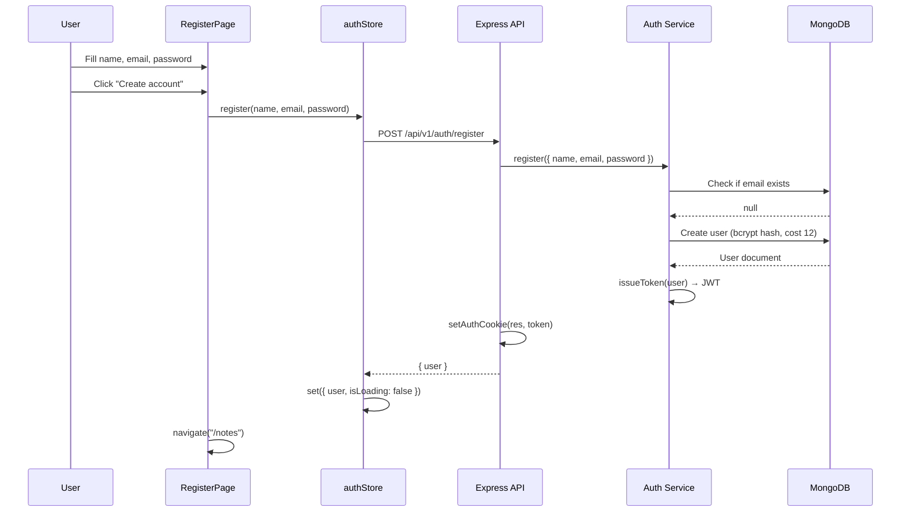
```mermaid
sequenceDiagram
    participant U as User
    participant R as RegisterPage
    participant AS as authStore
    participant API as Express API
    participant SVC as Auth Service
    participant DB as MongoDB

    U->>R: Fill name, email, password
    U->>R: Click "Create account"
    R->>AS: register(name, email, password)
    AS->>API: POST /api/v1/auth/register
    API->>SVC: register({ name, email, password })
    SVC->>DB: Check if email exists
    DB-->>SVC: null
    SVC->>DB: Create user (bcrypt hash, cost 12)
    DB-->>SVC: User document
    SVC->>SVC: issueToken(user) → JWT
    API->>API: setAuthCookie(res, token)
    API-->>AS: { user }
    AS->>AS: set({ user, isLoading: false })
    R->>R: navigate("/notes")
```

### Login Flow

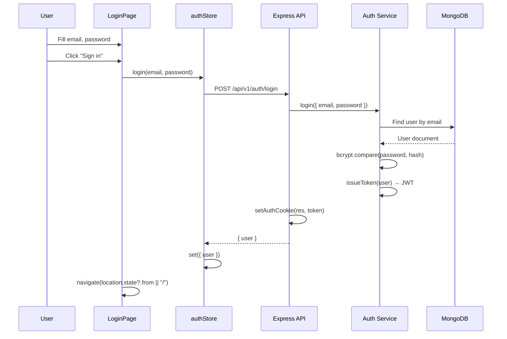
```mermaid
sequenceDiagram
    participant U as User
    participant L as LoginPage
    participant AS as authStore
    participant API as Express API
    participant SVC as Auth Service
    participant DB as MongoDB

    U->>L: Fill email, password
    U->>L: Click "Sign in"
    L->>AS: login(email, password)
    AS->>API: POST /api/v1/auth/login
    API->>SVC: login({ email, password })
    SVC->>DB: Find user by email
    DB-->>SVC: User document
    SVC->>SVC: bcrypt.compare(password, hash)
    SVC->>SVC: issueToken(user) → JWT
    API->>API: setAuthCookie(res, token)
    API-->>AS: { user }
    AS->>AS: set({ user })
    L->>L: navigate(location.state?.from || "/")
```

### Session Restore Flow

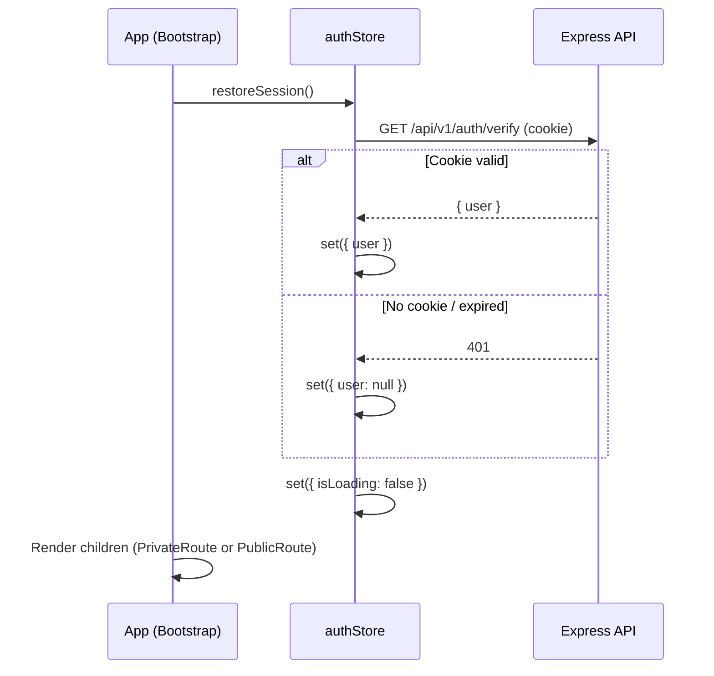
```mermaid
sequenceDiagram
    participant App as App (Bootstrap)
    participant AS as authStore
    participant API as Express API
    
    App->>AS: restoreSession()
    AS->>API: GET /api/v1/auth/verify (cookie)
    alt Cookie valid
        API-->>AS: { user }
        AS->>AS: set({ user })
    else No cookie / expired
        API-->>AS: 401
        AS->>AS: set({ user: null })
    end
    AS->>AS: set({ isLoading: false })
    App->>App: Render children (PrivateRoute or PublicRoute)
```

### Password Reset Flow

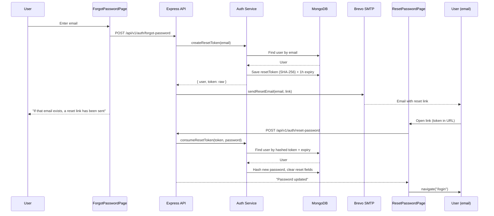
```mermaid
sequenceDiagram
    participant U as User
    participant FP as ForgotPasswordPage
    participant API as Express API
    participant SVC as Auth Service
    participant DB as MongoDB
    participant Brevo as Brevo SMTP
    participant RP as ResetPasswordPage
    participant U2 as User (email)

    U->>FP: Enter email
    FP->>API: POST /api/v1/auth/forgot-password
    API->>SVC: createResetToken(email)
    SVC->>DB: Find user by email
    DB-->>SVC: User
    SVC->>DB: Save resetToken (SHA-256) + 1h expiry
    SVC-->>API: { user, token: raw }
    API->>Brevo: sendResetEmail(email, link)
    Brevo-->>U2: Email with reset link
    FP-->>U: "If that email exists, a reset link has been sent"

    U2->>RP: Open link (token in URL)
    RP->>API: POST /api/v1/auth/reset-password
    API->>SVC: consumeResetToken(token, password)
    SVC->>DB: Find user by hashed token + expiry
    DB-->>SVC: User
    SVC->>DB: Hash new password, clear reset fields
    API-->>RP: "Password updated"
    RP->>U2: navigate("/login")
```

### Note Auto-Save Flow

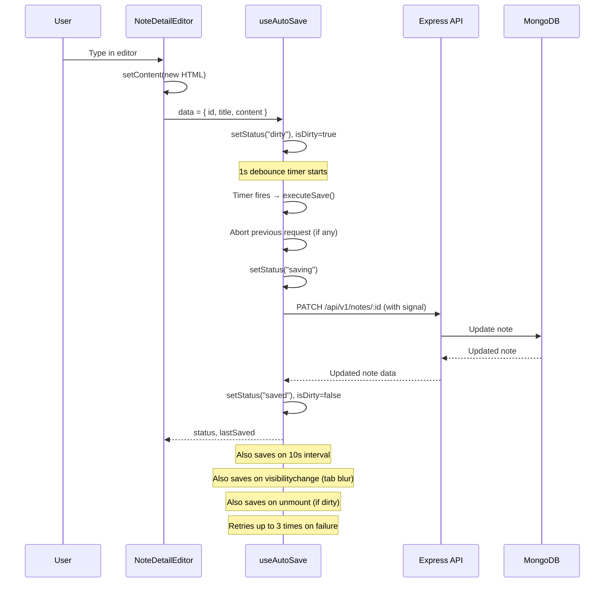
```mermaid
sequenceDiagram
    participant U as User
    participant NDE as NoteDetailEditor
    participant AS as useAutoSave
    participant API as Express API
    participant DB as MongoDB

    U->>NDE: Type in editor
    NDE->>NDE: setContent(new HTML)
    NDE->>AS: data = { id, title, content }
    AS->>AS: setStatus("dirty"), isDirty=true
    Note over AS: 1s debounce timer starts
    AS->>AS: Timer fires → executeSave()
    AS->>AS: Abort previous request (if any)
    AS->>AS: setStatus("saving")
    AS->>API: PATCH /api/v1/notes/:id (with signal)
    API->>DB: Update note
    DB-->>API: Updated note
    API-->>AS: Updated note data
    AS->>AS: setStatus("saved"), isDirty=false
    AS-->>NDE: status, lastSaved

    Note over AS: Also saves on 10s interval
    Note over AS: Also saves on visibilitychange (tab blur)
    Note over AS: Also saves on unmount (if dirty)
    Note over AS: Retries up to 3 times on failure
```

### Note Organization Flow

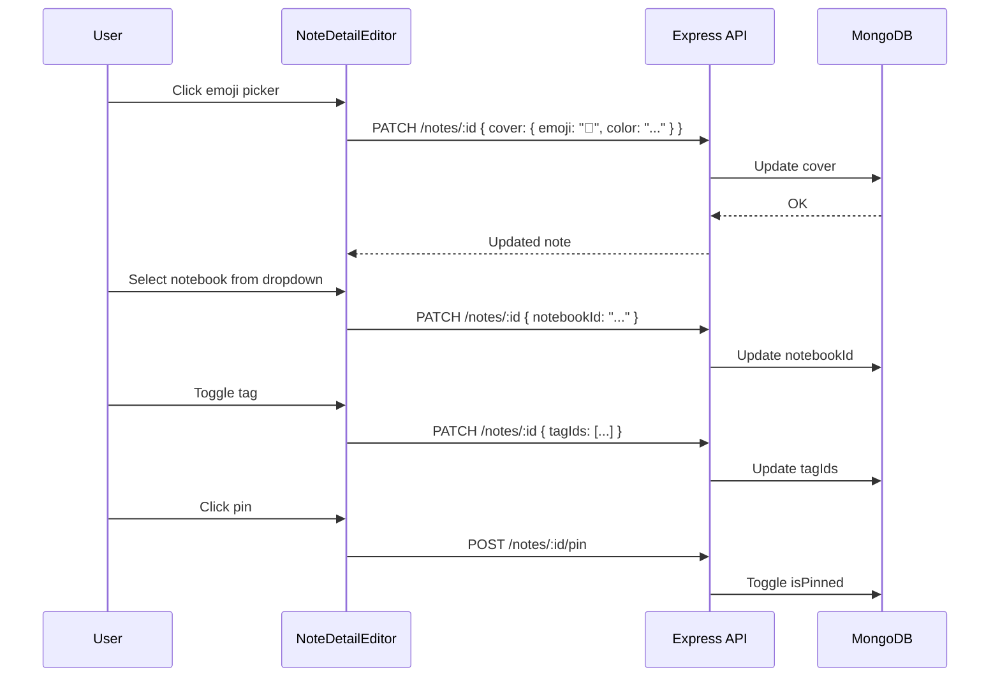
```mermaid
sequenceDiagram
    participant U as User
    participant NDE as NoteDetailEditor
    participant API as Express API
    participant DB as MongoDB

    U->>NDE: Click emoji picker
    NDE->>API: PATCH /notes/:id { cover: { emoji: "🚀", color: "..." } }
    API->>DB: Update cover
    DB-->>API: OK
    API-->>NDE: Updated note

    U->>NDE: Select notebook from dropdown
    NDE->>API: PATCH /notes/:id { notebookId: "..." }
    API->>DB: Update notebookId

    U->>NDE: Toggle tag
    NDE->>API: PATCH /notes/:id { tagIds: [...] }
    API->>DB: Update tagIds

    U->>NDE: Click pin
    NDE->>API: POST /notes/:id/pin
    API->>DB: Toggle isPinned
```

### Search Flow

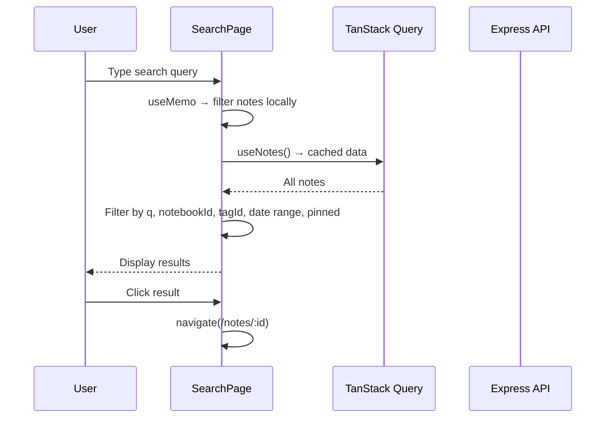
```mermaid
sequenceDiagram
    participant U as User
    participant SP as SearchPage
    participant Q as TanStack Query
    participant API as Express API

    U->>SP: Type search query
    SP->>SP: useMemo → filter notes locally
    SP->>Q: useNotes() → cached data
    Q-->>SP: All notes
    SP->>SP: Filter by q, notebookId, tagId, date range, pinned
    SP-->>U: Display results

    U->>SP: Click result
    SP->>SP: navigate(/notes/:id)
```

### Delete Notebook Flow

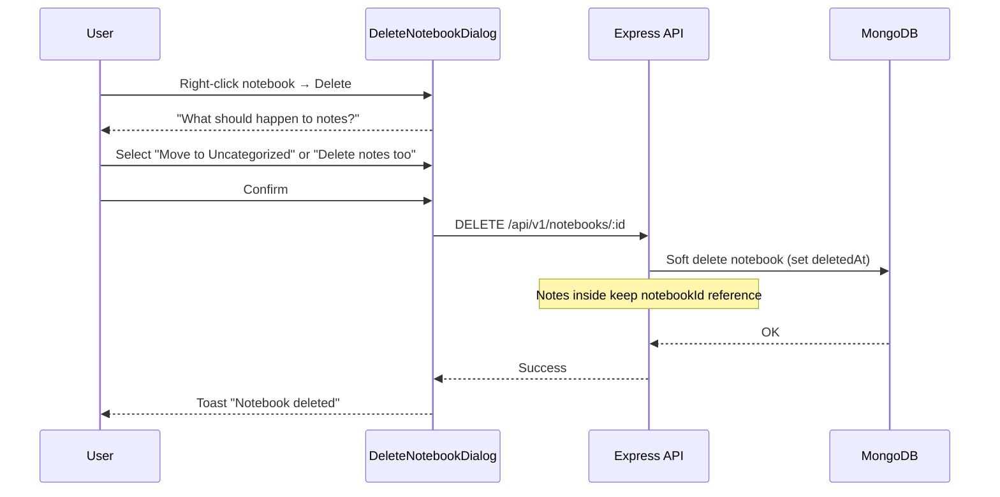
```mermaid
sequenceDiagram
    participant U as User
    participant DND as DeleteNotebookDialog
    participant API as Express API
    participant DB as MongoDB

    U->>DND: Right-click notebook → Delete
    DND-->>U: "What should happen to notes?"
    U->>DND: Select "Move to Uncategorized" or "Delete notes too"
    U->>DND: Confirm
    DND->>API: DELETE /api/v1/notebooks/:id
    API->>DB: Soft delete notebook (set deletedAt)
    Note over API: Notes inside keep notebookId reference
    DB-->>API: OK
    API-->>DND: Success
    DND-->>U: Toast "Notebook deleted"
```

---

## 10. COMPLETE DATA FLOW ANALYSIS

### Frontend → Backend Flow

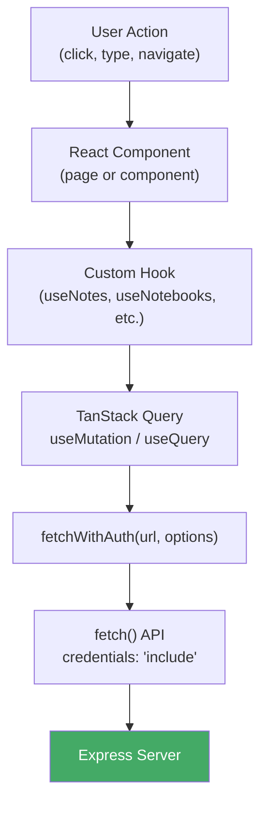
```mermaid
flowchart TD
    A["User Action<br/>(click, type, navigate)"] --> B["React Component<br/>(page or component)"]
    B --> C["Custom Hook<br/>(useNotes, useNotebooks, etc.)"]
    C --> D["TanStack Query<br/>useMutation / useQuery"]
    D --> E["fetchWithAuth(url, options)"]
    E --> F["fetch() API<br/>credentials: 'include'"]
    F --> G["Express Server"]
    
    style G fill:#4a6, color:#fff
```

**Step-by-step:**
1. **User Action:** Clicking "New note", typing in the editor, navigating routes
2. **React Component:** The component handles the event, calls the appropriate hook
3. **Custom Hook:** Wraps TanStack Query with pre-configured fetch logic
4. **TanStack Query:** Manages loading/error states, caching, deduplication
5. **fetchWithAuth:** Sets `credentials: "include"` to send the httpOnly JWT cookie, adds JSON Content-Type header (unless FormData), handles 401 errors
6. **fetch() API:** Native browser fetch with `credentials: "include"` ensures cookies are sent cross-origin (requires CORS `credentials: true`)
7. **Express Server:** Receives the request with cookie header

### Backend Processing Flow

```mermaid
flowchart TD
    A["HTTP Request"] --> B["helmet (security headers)"]
    B --> C["cors (CORS check)"]
    C --> D["cookieParser (parse cookie)"]
    D --> E["express.json (parse body)"]
    E --> F["generalLimiter (100/min)"]
    F --> G["Route-specific middleware"]
    G --> H{"authRequired?"}
    H -->|"Yes"| I["verify JWT from cookie"]
    I --> J["set req.userId"]
    J --> K["validate(validatorChain)"]
    H -->|"No"| K
    K --> L{"Validation passes?"}
    L -->|"No"| M["400 ValidationError"]
    L -->|"Yes"| N["Controller"]
    N --> O["Service (business logic)"]
    O --> P["Mongoose Query / Mutation"]
    P --> Q["MongoDB"]
    Q --> R["Result"]
    R --> S["Controller formats response"]
    S --> T["ok() / fail() helper"]
    T --> U["JSON Response"]
    M --> U
```

### Backend → Frontend Flow

```mermaid
flowchart TD
    A["JSON Response"] --> B["fetchWithAuth receives"]
    B --> C{"Response.ok?"}
    C -->|"Yes"| D["Extract .data from JSON"]
    C -->|"No"| E["Parse error JSON"]
    E --> F["throw new Error(message)"]
    F --> G["TanStack Query catches"]
    G --> H["Component catches in try/catch"]
    H --> I["toast.error(message)"]
    D --> J["TanStack Query caches data"]
    J --> K["Component re-renders with new data"]
    K --> L["Zustand store updated (if auth)"]
    L --> M["UI re-renders"]
```

---

## 11. AUTHENTICATION & AUTHORIZATION

### Implementation Summary

| Aspect | Detail |
|---|---|
| **Method** | JWT stored in httpOnly cookie |
| **Cookie Name** | `noteflow_token` |
| **JWT Payload** | `{ sub: userId }` |
| **JWT Expiry** | 7 days (configurable via `JWT_TTL`) |
| **Cookie Security** | httpOnly, secure in production, sameSite: lax, 7d maxAge |
| **Session Persistence** | Via `GET /auth/verify` on app boot |
| **Logout** | Clear cookie (set empty + immediate expiry) |
| **Password Hashing** | bcrypt, cost factor 12 |
| **Reset Token** | 32-byte random hex → SHA-256 hash stored → 1-hour expiry |

### Login Flow (detailed)

1. User submits email + password
2. Server finds user by email (case-insensitive)
3. `bcrypt.compare(password, user.password)` validates credentials
4. On success: `jwt.sign({ sub: userId }, JWT_ACCESS_SECRET, { expiresIn: '7d' })`
5. Cookie is set: `res.cookie("noteflow_token", token, { httpOnly, secure, sameSite: 'lax', maxAge: 7d })`
6. User object (minus password) returned in response body
7. Frontend stores user in Zustand `authStore`

### Token Refresh Flow

**Note:** There is **no refresh token mechanism**. The JWT has a 7-day lifetime.
- On expiry, the user gets a 401 on the next API call
- `fetchWithAuth` catches 401 and throws "Session expired"
- The component must handle the error (typically redirect to login)
- For a production app, a refresh token rotation should be implemented

### Protected Route Flow

1. App mounts → `Bootstrap` component calls `authStore.restoreSession()`
2. `restoreSession` calls `GET /api/v1/auth/verify` with credentials cookie
3. Two outcomes:
   - **Success (200):** `authStore` sets `user`, `isLoading = false` → `PrivateRoute` renders children
   - **Failure (401):** `authStore` sets `user = null`, `isLoading = false` → `PrivateRoute` redirects to `/login`
4. While loading, a "Loading..." screen is shown
5. `PublicRoute` inverts this: if user exists, redirect to `/`

---

## 12. STATE MANAGEMENT ANALYSIS

### Zustand (Client State)

**authStore:**
```
State: { user, isLoading, error }
Actions: register, login, logout, restoreSession, delete
Persistence: None (session restored via API call on boot)
```

**useUIStore:**
```
State: { theme, fontPref, sidebarOpen, cmdkOpen, noteListOpen }
Actions: setTheme, setFontPref, toggleSidebar, setSidebar, toggleCmdk, setCmdk, toggleNoteList, setNoteList
Middleware: devtools, immer, persist (to localStorage)
Partialize (persisted): theme, fontPref
```

**Key decisions:**
- Auth state lives in Zustand (not React Context) because it's needed everywhere
- UI preferences are persisted to localStorage (theme, fontPref survive refresh)
- Immer middleware simplifies nested state updates (e.g., `s.theme = newValue`)
- Devtools middleware enables Redux DevTools debugging

### TanStack Query (Server State)

**Query Key Convention:**
```
["notes"]          → useNotes()       (list)
["note", id]       → useNote(id)      (single)
["notebooks"]      → useNotebooks()   (list)
["tags"]           → useTags()        (list)
```

**Cache Invalidation Pattern:**
- Mutations invalidate the parent query key on success
  - `useCreateNote` → `invalidatesQueries(["notes"])`
  - `useUpdateNote(id)` → `invalidatesQueries(["note", id])`
  - `useCreateNotebook` → `invalidatesQueries(["notebooks"])`

**Optimization Opportunities:**
- Notes list is fetched on every page that needs it (no staleTime configured)
- Could add `staleTime: 30000` to reduce refetches
- Could use `keepPreviousData` for smoother navigation

---

## 13. ERROR HANDLING ANALYSIS

### Frontend Error Handling

| Layer | Strategy | Output |
|---|---|---|
| **React Component** | try/catch in event handlers | `toast.error(message)` |
| **TanStack Query** | `onError` callback, `isError` state | UI conditional rendering |
| **fetchWithAuth** | Check `response.status === 401`, throw | "Session expired" error |
| **Validation** | Client-side checks (password length, required fields) | `toast.error()` before API call |

### Backend Error Handling

| Layer | Strategy | Output |
|---|---|---|
| **Service** | `throw new Error(message)` with `.status` property | Caught by asyncHandler |
| **Controller** | Delegates to service, formats success via `ok()` | Consistent JSON |
| **Middleware (auth)** | `next(err)` with status and code | Processed by errorHandler |
| **Middleware (validate)** | Returns 400 JSON directly | Before controller |
| **Global errorHandler** | `normalizeError()` maps error types → codes | Consistent JSON error |

### Known Issue
There's a **typo in the middleware filename**: `backend/src/middleware/arror.js` should be `backend/src/middleware/error.js`. The import in `app.js` is `./middleware/arror.js` which works but is a misspelling.

---

## 14. SECURITY REVIEW

| Category | Current Implementation | Risk | Improvement |
|---|---|---|---|
| **Password Hashing** | bcrypt, cost factor 12 | Low | Adequate |
| **JWT Secret** | Strong random secret in `.env` | Low | Rotate periodically |
| **JWT Expiry** | 7 days (configurable) | Medium | Add refresh token rotation, short-lived access tokens (15 min) |
| **Cookie Security** | httpOnly, secure (prod), sameSite lax | Low | Add `__Host-` prefix for additional security |
| **Input Validation** | express-validator chains on all inputs | Low | Add rate limiting on note creation |
| **HTML Sanitization** | sanitize-html on server, DOMPurify on client | Low | Ensure both layers are in sync |
| **Rate Limiting** | Auth: 10/min, General: 100/min | Low | Add per-user rate limiting |
| **CORS** | Specific origin(s) from env, credentials: true | Low | Restrict to single origin in production |
| **Helmet** | Default helmet middleware | Low | Configure CSP for Cloudinary/Google Fonts |
| **XSS** | Server-side sanitize-html, client-side DOMPurify | Low | CSP would add defense in depth |
| **CSRF** | Cookie-based auth (sameSite: lax) | Medium | Add CSRF token for state-changing requests |
| **Account Enumeration** | Forgot password always returns 200 | Low | Adequate |
| **File Upload** | Multer, memory storage, image-only filter, 5MB limit | Low | Add file type validation by parsing magic bytes |
| **Environment Variables** | All in `.env` (git-ignored) | Low | Use secrets manager in production |
| **MongoDB URI** | Contains credentials in connection string | Medium | Restrict network access to Atlas, use IP allowlist |
| **API Keys in .env** | Cloudinary, Brevo keys in plaintext | Medium | Use secrets manager, rotate keys |

---

## 15. PERFORMANCE ANALYSIS

### Frontend

| Area | Current State | Recommendation |
|---|---|---|
| **Bundle Size** | No bundle analysis done | Run `vite build --report` or use `rollup-plugin-visualizer` |
| **Lazy Loading** | No route-level code splitting | Add `React.lazy()` for Settings, Search, auth pages |
| **Memoization** | `useMemo` on filtered notes, `useMemo` on autosave payload | Add `React.memo` on NoteCard, NoteList |
| **Re-renders** | Zustand selectors are used | Good — fine-grained subscriptions |
| **Image Optimization** | Avatars served from Cloudinary | Ensure Cloudinary transforms are used (w_96, q_auto, f_auto) |
| **Font Loading** | Google Fonts via CSS import | Add `font-display: swap`, preconnect to Google Fonts CDN |
| **Debouncing** | Auto-save debounce (1s) | Adequate |

### Backend

| Area | Current State | Recommendation |
|---|---|---|
| **Database Indexes** | `userId` indexed on all models, compound on name+userId | Add compound index `{ userId, deletedAt }` for filtered queries |
| **Query Optimization** | Notes list fetches all fields | Projection: `.select('title content wordCount updatedAt isPinned isFavorite isArchived deletedAt cover notebookId tagIds')` |
| **Caching** | None | Add Redis caching for frequently accessed data (notebooks, tags) |
| **N+1 Queries** | None observed | Tag/notebook counts are computed client-side from all notes — add aggregation pipeline |
| **Pagination** | None — all notes returned at once | Add cursor-based pagination for large note collections |
| **Rate Limiting** | In-memory | Switch to Redis-backed (`rate-limit-redis` already installed) |

---

## 16. DEPLOYMENT ARCHITECTURE

### Current Setup
- **No Docker or CI/CD configured**
- **Frontend:** Vite dev server (port 5173) for development
- **Backend:** Node.js (port 5000) with `--watch` flag for development
- **Database:** MongoDB Atlas (cloud)
- **File Storage:** Cloudinary (cloud)
- **Email:** Brevo API (cloud)

### Recommended Deployment Architecture

```mermaid
flowchart TD
    subgraph DNS["DNS"]
        A["noteflow.example.com"]
    end
    
    subgraph CDN["Vercel / Netlify"]
        B["Static SPA (dist/)"]
    end
    
    subgraph Compute["Render / Railway / Fly.io"]
        C["Node.js Express API<br/>Port 5000"]
    end
    
    subgraph Storage["MongoDB Atlas"]
        D["MongoDB Cluster"]
    end
    
    subgraph External["External Services"]
        E["Cloudinary"]
        F["Brevo SMTP"]
    end
    
    A --> B
    B -->|"API calls"| C
    C --> D
    C --> E
    C --> F
```

### Environment Variables (Production)

```
# Backend
NODE_ENV=production
PORT=5000
FRONTEND_ORIGIN=https://noteflow.example.com
MONGO_URI=mongodb+srv://...
JWT_ACCESS_SECRET=<strong-random>
JWT_TTL=7d
CLOUDINARY_CLOUD_NAME=...
CLOUDINARY_API_KEY=...
CLOUDINARY_API_SECRET=...
BREVO_API_KEY=...
BREVO_FROM_EMAIL=...
BREVO_FROM_NAME=NoteFlow
ANTHROPIC_API_KEY=...
AI_DAILY_QUOTA=20

# Frontend
VITE_BASE_API=https://api.noteflow.example.com/api/v1
```

---

## 17. CODE QUALITY REVIEW

### Ratings

| Dimension | Rating | Notes |
|---|---|---|
| **Architecture** | 7/10 | Clean separation (routes/controllers/services), but thin controllers and some inline logic |
| **Code Quality** | 7/10 | Consistent naming, but mixed conventions (camelCase, PascalCase), typo in filename |
| **Scalability** | 6/10 | No pagination, no caching, all notes fetched at once, no database read replicas |
| **Security** | 7/10 | Good foundation (helmet, CORS, validation, hashing), missing CSRF, refresh tokens |
| **Maintainability** | 8/10 | Well-organized files, clear responsibilities, consistent patterns |
| **Performance** | 5/10 | No lazy loading, no pagination, no bundle optimization, no caching |

### Detailed Evaluation

**Strengths:**
- Clean separation of concerns (routes → controllers → services → models)
- Consistent async/await pattern with `asyncHandler`
- Uniform response format (`ok()` / `fail()`)
- Middleware chain is well-organized
- Frontend state management is clean (Zustand for client, TanStack Query for server)
- Rich-text editor is well-integrated with auto-save
- Tailwind design system is comprehensive and themable
- Security headers via helmet, input validation, rate limiting

**Areas for Improvement:**
- `backend/src/middleware/arror.js` — typo in filename
- `frontend/src/lib/fecthWithAuth.js` — typo in filename (`fecth` vs `fetch`)
- No TypeScript — reduces type safety and developer experience
- No test suite — no unit, integration, or E2E tests
- No CI/CD pipeline
- No database migration system (Mongoose schema changes are manual)
- Notes list has no pagination — will degrade with thousands of notes
- Notebook/Tag deletion doesn't cascade or unlink notes
- Email service uses raw fetch instead of nodemailer (nodemailer is installed but unused)
- Password complexity rules are applied on login too (should only validate format on create/update)

---

## 18. IMPROVEMENT RECOMMENDATIONS

### Short-Term (Quick Wins)

| # | Improvement | Effort | Impact |
|---|---|---|---|
| 1 | Fix typo `arror.js` → `error.js` and `fecthWithAuth.js` → `fetchWithAuth.js` | 5 min | Professionalism |
| 2 | Add `staleTime: 30000` to notes/notebooks/tags queries | 10 min | Performance |
| 3 | Add route-level code splitting with `React.lazy()` | 30 min | Bundle size |
| 4 | Add `React.memo` on `NoteCard` | 10 min | Re-render perf |
| 5 | Add loading skeleton for Settings page | 15 min | UX |
| 6 | Add `.prettierrc` for consistent formatting | 5 min | Consistency |

### Medium-Term (Next Sprint)

| # | Improvement | Effort | Impact |
|---|---|---|---|
| 7 | Migrate to **TypeScript** | 2-3 days | Type safety, DX |
| 8 | Add **Jest/Vitest** test suite (unit + integration) | 3-5 days | Quality assurance |
| 9 | Implement **pagination** for notes list (cursor-based) | 1 day | Scalability |
| 10 | Add **Redis-backed rate limiting** (ioredis + rate-limit-redis already installed) | 1 day | Scalability |
| 11 | Implement **refresh token rotation** (15-min access + 7-day refresh in DB) | 1 day | Security |
| 12 | Add **CSRF protection** | 4 hours | Security |
| 13 | Add **bundle analysis** and optimize vendor chunk splitting | 4 hours | Performance |
| 14 | Implement **notebook deletion cascade** (unlink/nullify notebookId on notes) | 2 hours | Data integrity |

### Long-Term (Roadmap)

| # | Improvement | Effort | Impact |
|---|---|---|---|
| 15 | **AI integration** (wire up `ANTHROPIC_API_KEY` for smart suggestions) | 2 weeks | Feature |
| 16 | **Real-time collaboration** (WebSocket/Yjs-based collaborative editing) | 4 weeks | Feature |
| 17 | **Offline support** (Service Worker + IndexedDB + sync) | 3 weeks | UX |
| 18 | **Multi-language support** (i18n) | 2 weeks | Global reach |
| 19 | **OAuth login** (Google, GitHub) | 1 week | Auth UX |
| 20 | **Docker + docker-compose** for development | 4 hours | Dev environment |
| 21 | **GitHub Actions CI/CD** (lint → test → build → deploy) | 1 day | DevOps |
| 22 | **Database migrations** (mongodb-migrate or custom) | 1 day | Schema management |
| 23 | **API documentation** (OpenAPI/Swagger) | 2 days | Developer docs |
| 24 | **Audit logging** (track note changes) | 3 days | Compliance |

---

## 19. MERMAID DIAGRAMS (Complete Set)

### System Architecture Diagram

```mermaid
flowchart TB
    subgraph Client["Client Browser"]
        REACT["React 19 SPA"]
        VITE["Vite Dev Server (port 5173)"]
    end
    
    subgraph Server["Node.js Server"]
        EXP["Express 5 (port 5000)"]
        MW["Middleware"]
        API["REST API (/api/v1/*)"]
    end
    
    subgraph Services["External Services"]
        CL["Cloudinary (Image CDN)"]
        BR["Brevo (Email)"]
    end
    
    subgraph Data["Data Layer"]
        MONGO["MongoDB Atlas"]
    end
    
    REACT -->|"HTTP + Cookie"| EXP
    VITE -->|"HMR"| REACT
    EXP --> MW
    MW --> API
    API --> MONGO
    API --> CL
    API --> BR
```

### Frontend Architecture Diagram

```mermaid
flowchart TD
    subgraph Entry["Entry"]
        M["main.jsx"]
        CSS["index.css"]
    end
    
    subgraph Root["Root Component"]
        APP["App.jsx"]
        QC["QueryClientProvider"]
        RR["BrowserRouter"]
        BS["Bootstrap (session restore)"]
        SN["Sonner Toaster"]
    end
    
    subgraph Guards["Route Guards"]
        PR["PrivateRoute"]
        PBR["PublicRoute"]
    end
    
    subgraph Layout["Layout"]
        AL["AppLayout"]
        SB["Sidebar"]
        AH["AppHeader"]
        CP["CommandPalette"]
    end
    
    subgraph Pages["Pages"]
        LP["LoginPage"]
        RP["RegisterPage"]
        FPP["ForgotPasswordPage"]
        RPP["ResetPasswordPage"]
        NP["NotesPage"]
        NDP["NoteDetailPage"]
        SP["SearchPage"]
        STP["SettingsPage"]
    end
    
    subgraph State["State Management"]
        AS["authStore (Zustand)"]
        US["useUIStore (Zustand + persist + immer)"]
        TQ["TanStack Query Hooks"]
    end
    
    subgraph Editor["Editor"]
        NE["NoteEditor (TipTap)"]
        ET["EditorToolbar"]
    end
    
    M --> APP
    CSS --> APP
    APP --> QC
    APP --> SN
    QC --> RR
    RR --> BS
    BS --> PR
    BS --> PBR
    PR --> AL
    PBR --> LP
    PBR --> RP
    PBR --> FPP
    PBR --> RPP
    AL --> SB
    AL --> AH
    AL --> CP
    AL --> NP
    NP --> NDP
    NP --> SP
    NP --> STP
    LP --> AS
    RP --> AS
    NDP --> NE
    NDP --> ET
    NDP --> TQ
    SP --> TQ
    STP --> AS
    STP --> US
```

### Complete Data Flow Diagram

```mermaid
flowchart TD
    subgraph UserAction["User Action"]
        A1["Type in editor"]
        A2["Click 'New note'"]
        A3["Select notebook/tag"]
        A4["Toggle pin/favorite"]
        A5["Search query"]
        A6["Update settings"]
    end

    subgraph Component["React Component"]
        B1["NoteDetailEditor"]
        B2["AppHeader / ActionButtons"]
        B3["NoteDetailEditor (dropdowns)"]
        B4["NoteCard / NoteDetailEditor"]
        B5["SearchPage / CommandPalette"]
        B6["SettingsPage"]
    end

    subgraph Hook["Custom Hook"]
        C1["useAutosave"]
        C2["useCreateNote"]
        C3["useUpdateNote"]
        C4["useTogglePin/Fav/Archive"]
        C5["useNotes / client filter"]
        C6["useUpdateUser / useChangePassword"]
    end

    subgraph Fetch["Fetch Layer"]
        D["fetchWithAuth(url, options)"]
    end

    subgraph API["Express API"]
        E1["authRequired middleware"]
        E2["validate middleware"]
        E3["Auth/Note/Notebook/Tag Controller"]
        E4["Auth/Note/Notebook/Tag Service"]
    end

    subgraph DB["Database"]
        F["MongoDB (Mongoose)"]
    end

    subgraph External["External"]
        G["Cloudinary (avatar upload)"]
        H["Brevo (password reset email)"]
    end

    subgraph Result["Response"]
        I1["JSON { success, data, message }"]
        I2["Error JSON { success: false, code, message }"]
    end

    subgraph UIUpdate["UI Update"]
        J1["TanStack Query cache update"]
        J2["Zustand store update"]
        J3["Component re-render"]
        J4["Toast notification"]
    end

    A1 --> B1 --> C1 --> D --> E1 --> E2 --> E3 --> E4 --> F
    A2 --> B2 --> C2 --> D --> E1 --> E2 --> E3 --> E4 --> F
    A3 --> B3 --> C3 --> D --> E1 --> E2 --> E3 --> E4 --> F
    A4 --> B4 --> C4 --> D --> E1 --> E2 --> E3 --> E4 --> F
    A5 --> B5 --> C5
    A6 --> B6 --> C6 --> D --> E1 --> E2 --> E3 --> E4 --> F
    F --> I1 --> J1 --> J3
    I1 --> J2 --> J3
    I2 --> J4
    E4 --> G
    E4 --> H
```

### Authentication Flow Diagram

```mermaid
flowchart TD
    subgraph Registration["Registration"]
        REG_START["User submits form"] --> REG_VAL["Client validation"]
        REG_VAL --> REG_API["POST /auth/register"]
        REG_API --> REG_CHECK["Check if email exists"]
        REG_CHECK -->|"Exists"| REG_409["409 User already exists"]
        REG_CHECK -->|"New"| REG_HASH["bcrypt hash (cost 12)"]
        REG_HASH --> REG_CREATE["Create User in DB"]
        REG_CREATE --> REG_TOKEN["Issue JWT (sub: userId)"]
        REG_TOKEN --> REG_COOKIE["Set httpOnly cookie (7d)"]
        REG_COOKIE --> REG_DONE["201 { user }"]
    end

    subgraph Login["Login"]
        LOG_START["User submits form"] --> LOG_VAL["Client validation"]
        LOG_VAL --> LOG_API["POST /auth/login"]
        LOG_API --> LOG_FIND["Find user by email"]
        LOG_FIND -->|"Not found"| LOG_401["401 Invalid credentials"]
        LOG_FIND -->|"Found"| LOG_COMPARE["bcrypt.compare"]
        LOG_COMPARE -->|"Mismatch"| LOG_401
        LOG_COMPARE -->|"Match"| LOG_TOKEN["Issue JWT"]
        LOG_TOKEN --> LOG_COOKIE["Set httpOnly cookie"]
        LOG_COOKIE --> LOG_DONE["200 { user }"]
    end

    subgraph SessionRestore["Session Restore"]
        SESS_START["App mounts"] --> SESS_CHECK["authStore.restoreSession()"]
        SESS_CHECK --> SESS_API["GET /auth/verify"]
        SESS_API --> SESS_MW["authRequired middleware"]
        SESS_MW -->|"Valid token"| SESS_FIND["Find user by ID"]
        SESS_FIND --> SESS_OK["200 { user }"]
        SESS_MW -->|"Invalid/missing"| SESS_FAIL["401"]
        SESS_OK --> SESS_SET["authStore.set({ user })"]
        SESS_FAIL --> SESS_NULL["authStore.set({ user: null })"]
        SESS_SET --> SESS_DONE["isLoading = false → PrivateRoute"]
        SESS_NULL --> SESS_DONE2["isLoading = false → PublicRoute"]
    end

    subgraph Logout["Logout"]
        LOGOUT_START["User clicks Sign Out"] --> LOGOUT_API["POST /auth/logout"]
        LOGOUT_API --> LOGOUT_CLEAR["Clear cookie"]
        LOGOUT_CLEAR --> LOGOUT_STORE["authStore.set({ user: null })"]
        LOGOUT_STORE --> LOGOUT_NAV["navigate('/login')"]
    end
```

### API Request Lifecycle

```mermaid
sequenceDiagram
    participant C as React Component
    participant H as TanStack Hook
    participant F as fetchWithAuth
    participant E as Express
    participant MW as Middleware
    participant CTRL as Controller
    participant SVC as Service
    participant DB as MongoDB

    C->>H: Call hook (e.g., useNotes.query())
    H->>F: fetchWithAuth(url)
    F->>E: GET /api/v1/notes (with cookie)
    E->>MW: helmet, cors, cookieParser, json
    MW->>MW: authRequired → verify JWT
    MW->>MW: validate (if applicable)
    MW->>CTRL: req.userId set
    CTRL->>SVC: listNotes(userId, query)
    SVC->>DB: Note.find({ userId }).sort(sort)
    DB-->>SVC: Note[] documents
    SVC-->>CTRL: Notes array
    CTRL->>CTRL: ok(res, notes, "List notes")
    CTRL-->>F: 200 JSON response
    F-->>H: Parsed response.data
    H-->>C: Cached data → re-render
```

---

## 20. FINAL PROJECT SUMMARY

### Architecture Summary
NoteFlow is a **two-tier full-stack application** with a React 19 SPA frontend communicating with an Express 5 REST API over HTTP. Authentication is handled via JWT stored in httpOnly cookies. The frontend uses Zustand for client state and TanStack Query for server-state synchronization. The backend follows a layered architecture (routes → controllers → services → models) with middleware for auth, validation, rate limiting, and error handling. MongoDB Atlas serves as the primary database, Cloudinary handles image uploads, and Brevo powers transactional emails.

### Data Flow Summary
1. **User interacts** with the React UI → component calls a custom hook
2. **Hook** uses TanStack Query (for server data) or Zustand (for client data)
3. **fetchWithAuth** sends an HTTP request with `credentials: "include"` (JWT cookie)
4. **Express middleware** chain processes: security headers → CORS → cookie parse → body parse → rate limit → auth → validation
5. **Controller** receives the cleaned request, delegates to the **Service** layer
6. **Service** contains business logic and performs **Mongoose operations** on MongoDB
7. **Response** flows back through the same path as a consistent JSON object
8. **TanStack Query** caches the response and triggers a **re-render**

### Business Flow Summary
1. **Acquisition:** User discovers NoteFlow → Registers → Creates first note
2. **Retention:** User returns → Session auto-restores → Sees recent notes → Edits with auto-save → Organizes with notebooks/tags
3. **Power Use:** User leverages ⌘K command palette → Searches with filters → Favorites important notes → Archives old ones → Exports data
4. **Account Management:** User updates profile/password → Changes theme/font → Deletes account if needed

### Strengths
- Clean, consistent code structure with clear separation of concerns
- Beautiful, responsive UI with dark/light theme and dense information design
- Powerful rich-text editor with tables, task lists, code blocks, and syntax highlighting
- Smart auto-save with debounce + interval + visibility + retry logic
- Command palette for quick navigation and actions
- Comprehensive sidebar organization (notebooks, tags, favorites, archive, trash)
- Server-side HTML sanitization prevents XSS
- Structured error handling with typed error codes
- Rate limiting on auth endpoints

### Weaknesses
- No TypeScript — reduced type safety and IDE support
- No automated tests — no safety net for refactoring
- No pagination — will fail at scale (thousands of notes)
- No lazy loading — large initial bundle
- No CI/CD — manual deployment process
- Notes filtering is done client-side (fetch all → filter in JS) — not scalable
- Password validation regex is duplicated across validators (violates DRY)
- Typo in two filenames (`arror.js`, `fecthWithAuth.js`)
- No refresh token mechanism — if JWT is stolen, it's valid for 7 days
- Notebook/Tag deletion doesn't cascade to notes

### Technical Debt
- Redundant password validation regex (copy-pasted across 4 validator files)
- `ioredis` and `rate-limit-redis` installed but unused
- `archiver` installed but unused (ZIP export happens client-side)
- `nodemailer` installed but unused (Brevo API called via raw fetch)
- `ANTHROPIC_API_KEY` is empty — AI feature placeholder not wired
- `backend/src/middleware/arror.js` — misspelled filename
- Inline CSS in `email.service.js` — should use template or separate file
- No rate limiting on `POST /notes` (could be abused)

### Recommended Next Steps

| Priority | Action |
|---|---|
| 1 | Fix filename typos (`arror.js` → `error.js`, `fecthWithAuth.js` → `fetchWithAuth.js`) |
| 2 | Add pagination to notes endpoint |
| 3 | Implement refresh token rotation |
| 4 | Add test suite (Vitest for frontend, Jest for backend) |
| 5 | Migrate to TypeScript |
| 6 | Set up Docker + CI/CD pipeline |
| 7 | Add bundle splitting and lazy loading |
| 8 | Wire up AI feature with Anthropic API |
| 9 | Add CSRF protection |
| 10 | Set up Redis for rate limiting and caching |

### Future Scalability Plan

| Scale Level | Actions Required |
|---|---|
| **100 users** | Current architecture works. Add pagination. |
| **1,000 users** | Add Redis caching, database indexing optimization, read replicas |
| **10,000 users** | Microservices split (auth service, note service), message queue for async tasks, CDN for static assets, database sharding |
| **100,000 users** | Multi-region deployment, global CDN, event sourcing for audit, dedicated search service (Elasticsearch) |

---

*Document generated for developer onboarding. Last updated: June 2026.*
