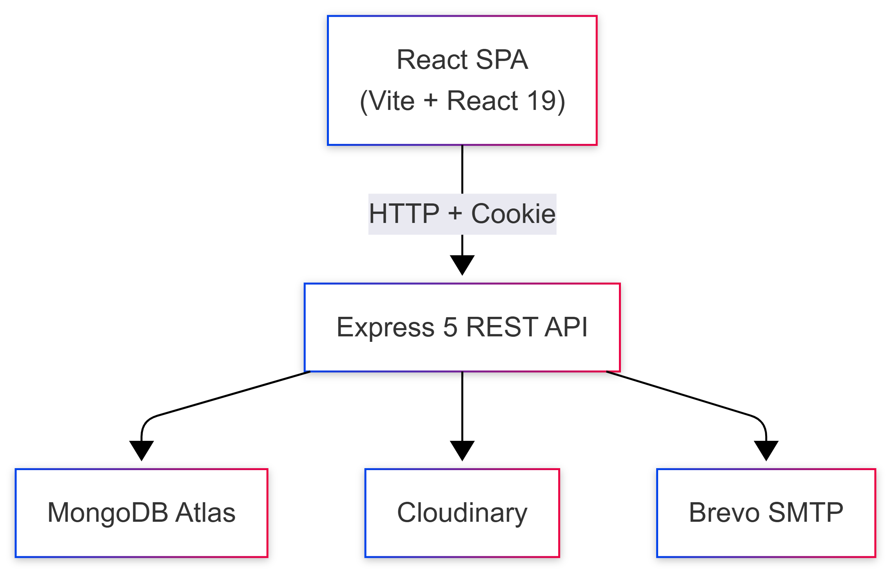
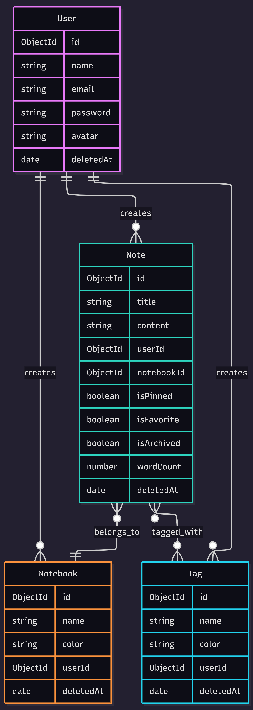
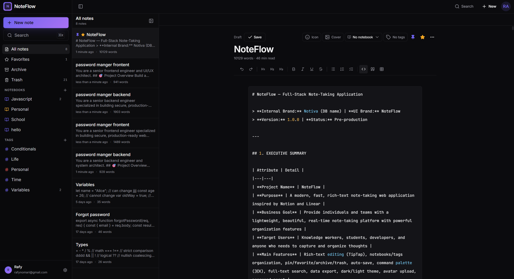

# NoteFlow — Full-Stack Note-Taking Application

> **Version:** 1.0.0 | **Stack:** React 19 + Express 5 + PostgreSQL (Prisma)

---

## 1. EXECUTIVE SUMMARY

| Attribute         | Detail                                                                                                                                                                               |
| ----------------- | ------------------------------------------------------------------------------------------------------------------------------------------------------------------------------------ |
| **Project**       | NoteFlow — A modern, fast, rich-text note-taking web app                                                                                                                             |
| **Target**        | Knowledge workers, students, developers                                                                                                                                              |
| **Core Features** | Rich-text editor (TipTap), notebooks/tags, pin/favorite/archive/trash, auto-save, ⌘K command palette, full-text search, dark/light theme, data export, avatar upload, password reset |
| **Architecture**  | Two-tier: React SPA (Vite) + Express REST API (Prisma → PostgreSQL)                                                                                                                  |



## 2. TECH STACK

**Frontend:** React 19, Vite 8, Tailwind CSS 3, Zustand 5, TanStack Query 5, React Router 7, TipTap 3, Radix UI, Lucide, cmdk, date-fns, DOMPurify, JSZip

**Backend:** Node.js, Express 5, Prisma 7, jsonwebtoken, bcrypt, express-validator, helmet, cors, cookie-parser, express-rate-limit, multer, cloudinary, sanitize-html

**Database:** PostgreSQL (Prisma Client + `@prisma/adapter-pg`)  
**Infrastructure:** Cloudinary (images), Hostinger Mail (email), Redis (rate limiting)

**Deployment:** Frontend on Vercel (`https://noteflow.rafytho.com/`), backend on Hostinger (`https://api-noteflow.rafytho.com/`)

---

## 3. FOLDER STRUCTURE

```
backend/
├── src/
│   ├── config/       # Cloudinary, Mailer, env config
│   ├── db/           # Shared PrismaClient singleton
│   ├── modules/      # Feature modules (auth, users, notes, notebooks, tags)
│   ├── routes/       # auth, me, notes, notebooks, tags
│   ├── controllers/  # Request/response handling
│   ├── services/     # Business logic
│   ├── middleware/    # auth, error, validate, upload, rateLimit
│   ├── validators/   # express-validator chains
│   └── utils/        # JWT tokens, response helpers, sanitize

frontend/
├── src/
│   ├── pages/            # Route-level components
│   ├── components/       # layout/, sidebars/, note/, search/, ui/
│   ├── editor/           # NoteEditor + EditorToolbar (TipTap)
│   ├── hooks/            # useNotes, useAuth, useAutosave, useTheme, etc.
│   ├── store/            # authStore, useUIStore (Zustand)
│   ├── lib/              # fetchWithAuth, utils (cn), sanitize
│   └── App.jsx           # Root: QueryClient + Router + Bootstrap
```

---

## 4. FRONTEND ARCHITECTURE

### Routing

```
/ -> redirect /notes
/login, /register, /verify-email, /update-password  (PublicRoute)
/notes, /favorites, /archive, /trash                    (PrivateRoute → AppLayout)
/notebooks/:notebookId, /tags/:tagId
/settings, /search
```

### State Management

- **Zustand:** `authStore` (user/session), `useUIStore` (theme/font/sidebar — persisted to localStorage)
- **TanStack Query:** All server state (notes, notebooks, tags, profile) — auto-caching, mutation invalidation
- All API calls via `fetchWithAuth` — uses `credentials: "include"` to send httpOnly JWT cookie

### Layout

```
AppLayout
├── Sidebar (collapsible, Sheet on mobile)
│   ├── ActionButtons (New note, Search)
│   ├── NavSections (All, Favorites, Archive, Trash)
│   ├── NotebooksSection → NotebookRow (×N)
│   ├── TagsSection → TagRow (×12 max)
│   └── UserSection
├── AppHeader (sidebar toggle, Logo, Search, New, Avatar)
├── <Outlet/> (page content)
└── CommandPalette (⌘K dialog overlay)
```

---

## 5. BACKEND ARCHITECTURE

### API Routes

| Prefix              | Auth     | Rate Limit | Purpose                                               |
| ------------------- | -------- | ---------- | ----------------------------------------------------- |
| `/api/v1/auth`      | Mixed    | 10/min     | register, login, logout, verify email, reset password |
| `/api/v1/me`        | Required | —          | profile, password, avatar, delete account             |
| `/api/v1/notebooks` | Required | —          | CRUD notebooks                                        |
| `/api/v1/tags`      | Required | —          | CRUD tags                                             |
| `/api/v1/notes`     | Required | —          | CRUD + pin/fav/archive/trash/purge/restore            |

### Middleware Chain

```
Request → helmet → cors → cookieParser → express.json (2MB) → httpLogger (dev) → generalLimiter (100/min)
→ Route-specific: authRequired | authLimiter | validate → Controller → Service → DB → Response
→ notFoundHandler (404) / errorHandler (global)
```

### Auth Flow

- JWT in httpOnly cookie (`noteflow_token`, 7d expiry, sameSite: lax)
- Session restored on app boot via `GET /auth/verify`
- Password: bcrypt (cost 12)
- Reset: 6-digit code, SHA-256 hashed in PasswordResetToken table, 15-minute expiry

---

## 6. DATABASE MODELS



## 7. KEY API ENDPOINTS

| Method           | Endpoint                       | Auth | Purpose                      |
| ---------------- | ------------------------------ | ---- | ---------------------------- |
| POST             | `/auth/register`               | No   | Create account (sets cookie) |
| POST             | `/auth/login`                  | No   | Sign in (sets cookie)        |
| POST             | `/auth/logout`                 | No   | Clear cookie                 |
| GET              | `/auth/verify`                 | Yes  | Restore session              |
| POST             | `/auth/reset-password-code`    | No   | Send 6-digit reset code      |
| POST             | `/auth/confirm-password-reset` | No   | Complete reset with code     |
| GET              | `/me`                          | Yes  | Get profile                  |
| PATCH            | `/me`                          | Yes  | Update name                  |
| POST             | `/me/password`                 | Yes  | Change password              |
| POST             | `/me/avatar`                   | Yes  | Upload avatar (multipart)    |
| DELETE           | `/me`                          | Yes  | Soft-delete account          |
| GET/POST         | `/notes`                       | Yes  | List/Create notes            |
| GET/PATCH/DELETE | `/notes/:id`                   | Yes  | Read/Update/Soft-delete note |
| POST             | `/notes/:id/pin`               | Yes  | Toggle pin                   |
| POST             | `/notes/:id/favorite`          | Yes  | Toggle favorite              |
| POST             | `/notes/:id/archive`           | Yes  | Toggle archive               |
| POST             | `/notes/:id/restore`           | Yes  | Restore from trash           |
| POST             | `/notes/:id/purge`             | Yes  | Permanent delete             |
| GET              | `/notes/trash`                 | Yes  | List trashed notes           |
| GET/POST         | `/notebooks`                   | Yes  | List/Create notebooks        |
| PATCH/DELETE     | `/notebooks/:id`               | Yes  | Update/Soft-delete notebook  |
| GET/POST         | `/tags`                        | Yes  | List/Create tags             |
| PATCH/DELETE     | `/tags/:id`                    | Yes  | Update/Soft-delete tag       |

**Response Format:** `{ success: bool, data: any, code: string|null, message: string }`

---

## 8. KEY USER WORKFLOWS

### Auto-Save

```
User edits title/content → useAutosave tracks a revisioned draft → 1s debounce
→ PATCH /notes/:id with expectedUpdatedAt
→ Only the newest revision may clear the dirty state
→ Temporary network/server failures retry up to 3 times
→ Navigation can flush before leaving; pagehide/visibilitychange use a best-effort flush
→ Unsaved drafts are retained in localStorage and can be restored after reopening
→ A stale expectedUpdatedAt returns 409 and is shown as a conflict instead of being retried
```

### Session Restore

```
App mounts → Bootstrap calls authStore.restoreSession()
→ GET /auth/verify (sends cookie)
→ 200: set user → PrivateRoute renders AppLayout
→ 401: set user=null → PublicRoute shows Login
```

### Search

```
User types query → SearchPage filters all notes client-side
→ Filters by: text, notebook, tag, date range, pinned status
→ Results shown inline + click navigates to /notes/:id
→ Query persisted in URL params (shareable)
```

---

## 9.SECURITY

### Key Security Measures

- httpOnly + secure + sameSite cookies for JWT
- bcrypt (cost 12) for passwords
- express-validator on all inputs
- sanitize-html (server) + DOMPurify (client) for XSS
- Rate limiting: auth (10/min), general (100/min)
- Helmet security headers
- CORS restricted to configured origins
- Password reset token hashed with SHA-256, 1-hour expiry

---

## 11. QUICK START

```bash
# Backend
cd backend
cp .env.example .env  # Fill in DATABASE_URL, JWT secrets, Cloudinary, Hostinger mail
npm install
npx prisma migrate deploy   # apply migrations (or `npx prisma migrate dev`)
npm run dev           # Port 5000

# Frontend
cd frontend
npm install
npm run dev           # Port 5173
```

**Frontend:** `http://localhost:5173`  
**Backend:** `http://localhost:5000`  
**API Base:** `http://localhost:5000/api/v1`

---

## 12. Frontend Preview

- Link: [Visit App](https://noteflow.rafytho.com/)

  
